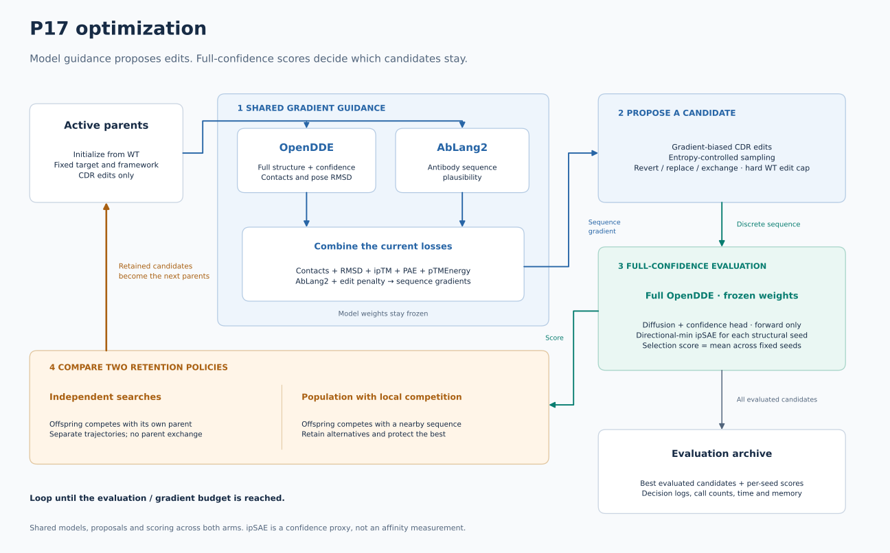

# P17 → JN.1 nanobody redesign

**Current summary and next actions (2026-09-23):
[P17 status and next steps](p17_status_and_next_steps.md).**
This document retains the detailed project history; the summary distinguishes
implemented work, verified behavior, outstanding review fixes and the next GPU run.

Project snapshot from 2026-09-21; search-policy handoff updated 2026-09-22.
Covers the goal, the biology, the predictor controls,
the infrastructure work that made it runnable, the current design pipeline, and
the open decisions.

**For Claude: read §10 first for the latest discussion and policy shortlist.**
**For Codex: read §11 for Claude's response — two literature additions, a
sequencing recommendation, and an infra note.**
**Latest implementation: §14 enables full OpenDDE confidence/RMSD gradients
for both policies and fixes the reviewed memory logging. GPU validation remains
pending. §§12–13 retain the initial implementation history.**
The current P17 search is an unfinished prototype, not a validated baseline.
The agreed direction retains mosaic's OpenDDE + AbLang2 gradient guidance,
keeps the framework fixed, and brings full interface-confidence evaluation into
selection. No additional model training is required for the initial comparisons.
The complete paper index is in §8.13; review-depth limits are recorded in the
[companion survey](protein_search_policy_review.md).

---

## 1. Goal

P17 is a neutralizing VHH (single-domain antibody, 123 aa) that binds the
SARS-CoV-2 **Alpha** variant spike RBD. It does **not** bind **JN.1**. The goal is
to redesign P17's CDR loops — within a small edit budget — so it recovers binding
to the JN.1 RBD at the same epitope.

Constraint that shapes everything downstream: this is **constrained scaffold
repair**, not de novo design. The framework stays fixed, only CDR positions are
designable, and the edit budget is small (5–7). We are not resampling a binder.

---

## 2. Biology: why P17 lost JN.1

Target identity between the two RBDs is **82.1%**, but the losses are
concentrated exactly where they hurt. All **five** P17 hotspot epitope residues
differ:

| Position | Alpha | JN.1 | Change |
|---:|:---:|:---:|---|
| 115 | N | D | charge introduced |
| 117 | L | W | large aromatic substitution |
| 146 | N | K | charge introduced |
| 148 | VE | K | **indel** |
| 150 | F | P | aromatic → proline |

Losing 5/5 hotspots — including an indel — is the biophysical argument that a
5-edit budget may be too tight, and that 7 is defensible. See §7.

### Structural inputs

| File | What it is | Provenance |
|---|---|---|
| `P17_Alpha.pdb` | P17 + Alpha RBD | **PDB 8GZ5**, X-ray, 1.70 Å, real B-factors (19.26–122.92) |
| `P17_JN1.pdb` | P17 + JN.1 RBD | **Model.** Alpha complex with the JN.1 RBD swapped in, PyRosetta-relaxed. All B-factors exactly 0.00 |

`P17_JN1.pdb` was verified to be a faithful transplant of the crystallographic
binding mode, not an arbitrary pose:

- the two RBDs superimpose at **1.71 Å** over 160 aligned residues
- carrying P17's crystal pose across onto the JN.1 frame lands **2.22 Å** from
  the modeled binder pose

So it is a legitimate target geometry: *where P17 would sit on JN.1 if it engaged
the way it engages Alpha.*

---

## 3. Predictor choice: OpenDDE

OpenDDE was chosen over ESMFold and alternatives because it **discriminates
binding from non-binding** on this system rather than confidently folding
everything.

Run configuration — native torch, **no MSA, no template**, recycling=3, 64
diffusion steps, bf16, 3 seeds. Raw outputs in
`results/p17_alpha_vs_jn1_native_opendde/{comparison,rmsd_ipsae}.csv`.

### 3.1 Confidence metrics, per seed

| Complex | seed | ipTM | pTM | plDDT | ranking | gPDE | **cross-chain gPDE** | clash |
|---|---:|---:|---:|---:|---:|---:|---:|:--:|
| P17+Alpha | 0 | 0.9006 | 0.9351 | 94.23 | 0.9075 | 0.432 | **0.699** | no |
| P17+Alpha | 1 | 0.9007 | 0.9349 | 94.21 | 0.9075 | 0.432 | **0.702** | no |
| P17+Alpha | 2 | 0.9017 | 0.9354 | 94.30 | 0.9084 | 0.432 | **0.691** | no |
| P17+JN.1 | 0 | 0.2225 | 0.6428 | 88.26 | 0.3066 | 0.858 | **12.466** | no |
| P17+JN.1 | 1 | 0.2968 | 0.6838 | 88.67 | 0.3742 | 0.746 | **8.690** | no |
| P17+JN.1 | 2 | 0.5794 | 0.8007 | 89.78 | 0.6237 | 0.608 | **4.497** | no |

### 3.2 Geometry and interface, per seed

| Complex | seed | binder pose RMSD | target RMSD after align | ipSAE (B→T) | ipSAE (T→B) | ipSAE min | iface res (B/T) |
|---|---:|---:|---:|---:|---:|---:|---:|
| P17+Alpha | 0 | **2.44 Å** | 0.66 Å | 0.8125 | 0.7952 | 0.7952 | 51 / 42 |
| P17+Alpha | 1 | **2.96 Å** | 0.68 Å | 0.8118 | 0.7954 | 0.7954 | 49 / 42 |
| P17+Alpha | 2 | **1.98 Å** | 0.74 Å | 0.8122 | 0.7949 | 0.7949 | 50 / 41 |
| P17+JN.1 | 0 | **22.37 Å** | 1.84 Å | 0.0000 | 0.0000 | 0.0000 | **0 / 0** |
| P17+JN.1 | 1 | **52.47 Å** | 1.87 Å | 0.0360 | 0.0113 | 0.0113 | 16 / 8 |
| P17+JN.1 | 2 | **57.56 Å** | 1.85 Å | 0.2339 | 0.1629 | 0.1629 | 32 / 25 |

ipSAE computed at `pae_cutoff=12, dist_cutoff=12`; reimplementation verified
against DunbrackLab/IPSAE. Headline column is the `d0res`/asym-max variant;
`dist_cutoff` does not feed the score.

### 3.3 What the numbers say

**The chains fold fine in both cases.** plDDT is 94.2 (Alpha) vs 88.3–89.8 (JN.1)
— high in both. The model is not confused about either protein. Only the
*interface* fails.

**The target realigns in both cases** — 0.66–0.74 Å vs 1.84–1.87 Å. This isolates
the entire gap to **binder placement**, which is the single most important control
in the whole comparison.

**Cross-chain gPDE is the cleanest discriminator** — 0.69–0.70 vs 4.50–12.47, a
~17× separation at its widest, wider and more monotone than ipTM. Worth
considering as a selection metric alongside ipSAE.

**JN.1 seed 0 found literally no interface** — ipSAE exactly 0.0 with **0/0**
interface residues at the cutoff. Not a weak interface; none.

**JN.1 variance is itself informative.** Seed 2 is a partial outlier (ipTM 0.579,
ipSAE 0.234, 32/25 interface residues) while seeds 0–1 are decisive. Alpha by
contrast is reproducible to ±0.001 ipTM. A binder that does not bind produces an
*unstable* answer, which argues for multi-seed scoring of every candidate and for
ranking on cross-seed variance, not just the best value (§8.5).

**No clashes anywhere**, so the JN.1 failures are not steric-rejection artifacts.

### 3.4 What the model actually sees

Critically, the model is fed **sequences only**:

```python
features, _ = opendde.binder_features(len(binder_seq), [TargetChain(target_seq, use_msa=False)])
```

No template, no MSA. `P17_JN1.pdb` is used only to (a) extract the two sequences,
(b) compute `reference_distances` for the pose-drift loss term, and (c) score
RMSD after the fact.

This matters for interpretation: the 22–58 Å result is **not** the model failing
to reproduce a pose it was shown. It is a de novo prediction from sequence that
lands nowhere near the built pose, and an ipSAE of ~0.0 is the model reporting no
confidence in any interface at that site.

---

## 4. Infrastructure

### The OOM problem and its resolution

mosaic's JAX path (via `jopendde`) originally needed **29.79 GiB** and could not
run on the 24 GB RTX 4090, while native torch could. Root cause, after
investigation: **not** tiled/flash attention kernels — torch with `-d fp32` also
OOMs (~26.6 GiB). Same weights, same architecture, comparable fp32 memory. The
real difference is that torch exposes `-d bf16` (`torch.autocast`, i.e.
mixed precision — matmuls in bf16, weights and reductions in fp32) and the JAX
port never implemented it.

Two fixes, both landed:

1. **Autocast-style bf16 attention**, now the **default**, with a
   `JOPENDDE_ATTENTION_DTYPE=fp32` escape hatch — `patches/patch_jopendde_bf16_dtype.py`
2. **`jax.lax.scan` over the role-pair projection** — replaced a `jnp.stack` of
   49 projections (`54 × f32[621,621,384]` = 29.79 GiB) with a scan accumulator.
   Verified **bit-exact** (0.0 max abs diff in float64). Native torch chunks this
   path (`pair_chunk_size: 128`); the JAX port dropped that.

Result: **29.79 GiB → 15.37 GiB peak**, ipTM ~0.885–0.892 vs torch's 0.9006.

Note: run-to-run non-determinism of ~0.007 ipTM was observed across processes
(XLA autotuning); two runs within one process agree exactly.

### N = 621 explained

Structural tokens are a second token stream (~2 subtokens/residue; glycine gets
1), present in **both** repos. Combined with mosaic featurizing the binder as
**poly-Trp** — so any residue can be substituted mid-search — this gives 3273
atoms vs torch's 2475.

### What runs where

| Workload | Local RTX 4090 (23.51 GiB) |
|---|---|
| Forward-only structure prediction (JAX) | ✅ 15.37 GiB |
| Native torch, `-d bf16` | ✅ ~10 s/seed |
| Native torch, `-d fp32` | ❌ OOM (~26.6 GiB) |
| Gradient-guided MCMC search | ❌ OOM — `f32[4,48,384,307,307]` = 25.90 GiB backward activation |

The 25.90 GiB tensor is 48 pairformer blocks × 4 recycles; 307 = 123 binder + 184
target. Cluster: `gpu21-sublab:/storage/frank/mosaic`.

**Untested idea:** pure-bf16 model + features on the `distogram` path (which skips
the ConfidenceHead) could roughly halve that tensor and make the search run
locally.

### Commits

```
e429a68  Default jopendde's attention core to bf16, with an fp32 escape hatch
cfcbe48  Track the OpenDDE input JSONs behind the P17 comparison
1835143  Make mosaic's OpenDDE path fit on a 24GB GPU (29.79GiB -> 15.25GiB)
382901c  Add RMSD + ipSAE(12,12) analysis of native-OpenDDE P17 predictions
51adad2  Fix P17_Alpha.pdb residue parsing: filter to real amino acids
```

---

## 5. The design pipeline

`examples/p17_hallucination_search.py`

### Designable space

CDR ranges from ANARCI (IMGT) on P17's own sequence — CDR1 26–33, CDR2 51–58,
CDR3 97–109 (13 residues; **not** VHH72's 97–114). **29 designable positions.**

### Two stages

1. **Continuous relaxation** — `simplex_APGM`, 200 steps, stepsize 0.05, scale 1.2
2. **Discrete budgeted search** — `edit_budgeted_gradient_mcmc` (default), 100
   steps; or `edit_budgeted_greedy_descent`, 200 steps

Stage 2 is seeded from stage 1's result via `--apgm-seed-mode argmax`, **not**
from WT. (`--apgm-steps 0` skips to a WT start.)

### Loss terms

| Term | Weight | Anchored to | Encodes |
|---|---:|---|---|
| `BinderTargetContact` | 0.5 | 5 hotspot epitope residues | **direction** — make these contacts |
| `BinderPoseDistogramDrift` | — | `P17_JN1.pdb` geometry | **endpoint** — the real binding pose |
| `EditBudget` | 5.0 | WT P17 sequence | **origin** — soft hinge `relu(E − budget)` |
| AbLang2 | 0.10 | — | sequence naturalness |

Pose tolerance is **calibrated at runtime**: `wt_pose + POSE_DRIFT_MARGIN` (3.0 Å),
where `wt_pose` is OpenDDE's own measured drift on the WT sequence.

All three anchors are present — so the search does know where it starts, where it
should end, and which direction to move. This holds regardless of whether stage 2
starts from WT or from the APGM rounding; the endpoint lives in the loss, not the
initialization.

### How MCMC decides what to keep

- **Proposal:** `delta = g − g[current]` (first-order Δloss per (pos, aa)), mask
  non-designable and budget-violating entries to `inf`, `softmax(−delta/proposal_temp)`,
  sample; repeat 1–2×
- **Acceptance:** `log_accept = min(0, (v − v_prop)/temp)` on the **true** loss
- Defaults: `temp=0.02`, `proposal_temp=0.01`. Cold — Δ=0.02 → 37% accept,
  Δ=0.1 → 0.7%
- Output: a **Pareto dict** `{edit_count: (loss, seq)}`

Three known issues:

1. The proposal log-prob is computed then **discarded**
   (`proposal, mutation, _ = sampled`), so there is no q-ratio. This is **not**
   true Metropolis-Hastings. It is an MCMC-inspired stochastic optimizer;
   the acceptance rule does not establish sampling from a Boltzmann target.
2. `proposal_temp=0.01` may concentrate proposals strongly, depending on gradient
   scale. Proposal entropy has not established how deterministic this is in P17.
3. `delta` is a long linear extrapolation across a non-linear loss, and
   concentrated proposals may overcommit to that approximate ranking. `_value_scores` already
   exists and could screen top-k against the true loss.

**Neither `temp` nor `proposal_temp` is passed at the call site or exposed on the
CLI** — both sit at library defaults and have never been swept.

---

## 6. The core caveat

Every in-loop term is a **geometric proxy** — predicted contacts and a distance
map. None measures whether OpenDDE *believes the complex forms*. That is
ipSAE/ipTM from the full path, deliberately excluded because the hard
`pae < cutoff` mask is non-smooth and useless for gradients.

Consequence: the cheap in-loop loss can keep improving while the real structural
signal does not follow — which has already been observed on this project. The
search optimizes the **predictor's opinion**, so final candidates require scoring
outside the loop that drove them.

`p17_hallucination_mcmc_with_full_opendde_rescoring.py` already computes the real
value but does not yet act on it.

---

## 7. Open decisions

### Edit budget 5 → 7

**For:** all 5 hotspots changed, including an indel. 5 edits to repair 5 lost
contacts leaves no slack.

**Against:** search space grows ~4,800× — C(29,5)·19⁵ ≈ 2.9e11 → C(29,7)·19⁷ ≈ 1.4e15.

**Recommendation:** run at 7 **in addition to**, not instead of, budget 5.

⚠️ **Corrected.** An earlier revision claimed the Pareto front "subsumes" the
budget-5 result because it returns 5/6/7 in one run. That is wrong: enlarging a
feasible set does not guarantee a finite stochastic search recovers the
smaller-budget run's result. A budget-7 chain explores a different trajectory, and
its `edit_count=5` entry is whatever that trajectory happened to pass through — not
a dedicated budget-5 search. The two must be run and compared separately.

Note: the edit-count trend evidence available locally is **VHH72 (125 aa), not
P17**. P17's own `results/p17_sweep/combined.csv` is on the cluster.

Corrected earlier claim: "every run spends its full budget, 0/110 overshoot" is
**not** evidence for raising the budget — `num_mutations_from_wt == edit_count`
is structurally guaranteed by the Pareto output format.

### Proposal temperature annealing

Concentrated proposals could make an unfavorable APGM→discrete rounding difficult
to revise. The prototype permits stochastic moves and reversions, so it is
incorrect to say that it has no escape mechanism; practical exploration needs
measurement.

**Distinct from a prior negative result:** `--apgm-seed-mode sample/topk` was
tested on VHH72 and hurt — but that randomizes the *starting point*. Annealing
`proposal_temp` keeps the good seed and allows escape *during* the chain. Not the
same experiment.

**Proposal:** expose exploration controls and compare fixed versus adaptive
proposal entropy. Keep the existing settings as a prototype reference. Earlier
significance testing on another task does not establish a validated P17 baseline.
No numerical temperature schedule is selected by this document.

This compounds with the budget question: a bigger budget with near-greedy
proposals walks *further down the same path* rather than exploring more of it.

### AbLang2 in bf16 — **no**

44.8M params = 171 MiB fp32. bf16 saves 86 MiB, ~0.5% of peak, on a
gradient-supplying term already down-weighted to 0.10. Not worth the numerical
risk.

---

## 8. Search policy: full inventory

A companion survey — `docs/protein_search_policy_review.md` (Codex, 2026-09-21) —
covers the literature more rigorously than the first pass in this document and
**corrected several claims here**. Corrections are marked ⚠️ below and in §8.9.

### 8.0 Framing: five composable decisions

Following the companion review, "search policy" is not one choice but five:

1. **Representation** — discrete sequences, relaxed probabilities, learned latents, or partially denoised structures
2. **Proposal** — random edits, LM suggestions, gradient-informed edits, recombination, generative sampling
3. **Search memory** — one chain, many chains, a population, a beam, or a learned policy
4. **Evaluation allocation** — which proposals get cheap scoring, expensive prediction, or repeat seeds
5. **Feedback** — whether results update an archive, a population, a surrogate, or a generative policy

The reviewed prototype is: relaxed→discrete / gradient-informed / **single active
sequence** / cheap evaluation / **cheap-score feedback, without full-confidence
selection feedback**. Its best-per-edit-count archive is not an active population.
Search memory and feedback from the expensive evaluator are the main proposed changes.

### 8.1 Already implemented in `src/mosaic/optimizers.py`

Nine optimizers exist. The P17 script uses **two**.

| Optimizer | Space | Key defaults | Used? |
|---|---|---|:--:|
| `simplex_APGM` | continuous simplex | `stepsize`, `momentum`, `scale=1.0` | ✅ stage 1 |
| `batched_simplex_APGM` | continuous `[B,N,20]` | batched over B | ❌ |
| `edit_budgeted_gradient_mcmc` | discrete, budgeted | `steps=100`, `batch_size=3`, `temp=0.02`, `proposal_temp=0.01`, `max_path_length=2` | ✅ stage 2 |
| `edit_budgeted_greedy_descent` | discrete, budgeted | `batch_size=16`, `steps=200` | ✅ `--policy greedy` |
| `gradient_MCMC` | discrete, unbudgeted | `temp=0.001`, `proposal_temp=0.01`, **`detailed_balance=False`** | ❌ |
| `batch_greedy_descent` | discrete, unbudgeted | `batch_size=16`, `steps=100` | ❌ |
| `biohub_optimizer` | continuous logits | `n_steps=150`, `lr=0.1`, tail-select over last 20 steps | ❌ |
| `colabdesign_stage` | continuous, annealed | `soft_start→soft_end`, `temp_start→temp_end` | ❌ |
| `bindcraft_design` | continuous, 4-stage | `logits_iters=(50,25)`, `soft_iters=45`, `hard_iters=5` | ❌ |

Dormant machinery that addresses problems flagged elsewhere in this document:

- **`gradient_MCMC` exposes `detailed_balance`**; the budgeted variant does not (§8.2)
- **`colabdesign_stage` anneals** soft/temp across a stage — the hot→cold schedule the discrete search lacks, already written, on the continuous side
- **`biohub_optimizer` has tail-select** via a separate `tail_loss_function` — a ready-made hook for scoring with the expensive full-path metric without paying per step (§6)

### 8.2 Gradient-informed sampling: scale and detailed balance

[EvoProtGrad / PPDE](https://arxiv.org/pdf/2212.09925) is a close algorithmic
relative: discrete gradient proposals, multistep paths, and forward/reverse
proposal probabilities in acceptance. The budgeted mosaic prototype discards its
proposal log probability and does not include the reverse-proposal correction.
It should be described as an MCMC-inspired optimization heuristic, not exact MH.

**Correction:** the earlier claim that `0.01` is "200× colder than the principled
value 2" was not justified. PPDE's factor of two applies to its specified log-target
scale; mosaic's weighted loss has a different scale. If a target distribution is
defined by `exp(-loss/T)`, that choice of `T` also scales its gradients. Proper MH
does not eliminate the choice of target distribution or its temperature.

Measure proposal entropy, accepted moves, and sequence diversity before drawing
conclusions from the raw temperature. Adaptive entropy is a candidate control
(§10), not an established fix. Correct sampling and effective optimization under
limited compute are distinct objectives.

### 8.3 ⭐ Position selection may matter more than the sampler (LaMBO-2)

LaMBO-2 (NeurIPS 2023) is the closest *problem* match: antibody optimization under
locality and developability constraints, with real in vitro validation (99%
expression, 40% binding). Its headline mechanism is for exactly our regime —
"stronger performance with **limited edits** through a novel application of
saliency maps."

The mechanism: take the gradient of the value function w.r.t. embeddings to find
**which positions** most affect the objective, and concentrate edits there. Their
Figure 3 saliency map on an antibody VH concentrates on **CDRH3** — the region
experts pick manually — while still allocating some budget to **framework and
other CDRs, "since these positions may also affect binding."**

Implications for P17: the CDR mask defines eligibility, but the current gradient
softmax already assigns nonuniform probabilities to position/substitution pairs.
Explicit position selection would change that policy; it is not the first use of
positional information. The useful question is which allowed CDR positions to
spend the small edit budget on, and when to reconsider them. **Framework positions
remain fixed by the project constraint.** The paper's broader allowed space does
not justify expanding ours. Embedding saliency and reductions of mosaic's
amino-acid gradients are related ideas, not identical implementations.

### 8.4 ⭐ The low-edit regime is its own regime (PEX)

PEX (ICML 2022) maintains a **proximal frontier** — non-dominated solutions trading
predicted fitness against Hamming distance from wild type — and explores near that
frontier rather than optimizing either axis alone. It reports outperforming
AdaLead, genetic algorithms, BO and MCMC, with advantages concentrated under low
edit counts, and argues the low-edit regime needs a *different policy* than
unconstrained search.

Relevance: continuous relaxation uses a soft `EditBudget` hinge, while the
discrete stage also enforces a hard WT-relative cap. PEX-style parent selection
across distance/fitness tradeoffs is a separate idea. The existing best-per-edit-
count dictionary is bookkeeping, not frontier-driven exploration; adopting that
exploration would not require removing the hard cap.

⚠️ PEX is benchmarked on learned fitness models over measured landscapes, not a
structural oracle. A hard mutation cap does not reproduce its exploration policy.

### 8.5 ⭐ Adaptive parent selection (AdaLead)

AdaLead's selection rule is `S = {x | φ(x) ≥ max(y)·(1−κ)}` — a threshold relative
to the best score so far. The behavior this produces is the interesting part, in
the authors' own framing: when the landscape is **flat**, many sequences clear the
filter and the algorithm **explores**; when there is a **prominent peak**, it
climbs rapidly.

That adapts **parent selection** to landscape shape. Proposal temperature controls
a different decision, so the two mechanisms can coexist. The threshold parameter
still needs choosing; relative thresholds also need care when ipSAE values are
zero or tied. This is a source of design ideas, not a parameter-free solution.

Two further findings worth keeping:

- AdaLead "out-competes more complex" BO/RL/CbAS/DbAS methods across FLEXS
  landscapes and is **robust even with an uninformative model** — directly relevant
  given §6, where our in-loop objective is a known-imperfect proxy.
- "Some algorithms are faster to climb in the first couple of batches, but none
  outperform AdaLead in the longer horizon" — a caution against judging policies on
  early progress.
- Recombination contributes only a **small** share of its gain, so most of the
  benefit comes from the adaptive threshold and rollouts, not crossover.

⚠️ Benchmarked on RNA landscapes with ground-truth simulators plus less-accurate
protein simulators — not structure-prediction oracles.

### 8.6 Expensive-evaluation allocation (BO-EVO / BoGA / LaMBO-2)

BO-EVO uses GP uncertainty and an acquisition function to prioritize evolutionary
proposals. BoGA puts evolutionary proposals inside an online surrogate loop and is
closer to our setting because it targets *computational* structure objectives
rather than requiring an assay per round.

⚠️ **Corrected.** This document previously reported "+11% over MCMC, +21% over pure
EA." Accurately: **11% and 21% increases in round-five success ratio against its
MCMC and AdaLead baselines respectively.** The second baseline is AdaLead, not
generic evolution, and this is one benchmark result — not an expected improvement
over mosaic's particular gradient-guided constrained implementation.

Relevance is real regardless: a surrogate absorbs expensive true-objective calls,
which is our stated bottleneck (§6). But a surrogate trained on OpenDDE confidence
learns *computational confidence*, not affinity — it does not escape §6, it only
makes the proxy cheaper to query.


### 8.7 Other policy families

| Work | Contribution | Transfer boundary |
|---|---|---|
| MosPro (2025) | Discrete gradient sampling + multi-objective gradient balancing | Relevant when objectives conflict. Keeping one best sequence per edit count is **not** the same as a frontier over interface quality, plausibility and structural agreement |
| GGS / smoothed fitness landscapes (2024) | Smooths learned landscapes, then gradient-informed discrete sampling | Search difficulty can be a property of the landscape, not the sampler. Does not establish that smoothing OpenDDE output preserves structural information |
| CbAS (ICML 2019) | Adapts a generative distribution toward desired properties while respecting a prior | Addresses exploiting unreliable predictor regions — our §6 risk. Staying near a prior is not a guarantee of binding |
| GFlowNets (ICML 2022) | Learns to generate diverse rewarding candidates in an active loop | Batch diversity and amortized proposals; training overhead hard to justify for one small campaign |
| Fast SeqProp (2020) | Differentiable optimization through discrete samples | Relevant to our soft→discrete handoff (the `argmax` rounding in §5). Abstract-level review only |
| LaMBO-1 (ICML 2022) | Multi-objective BO with denoising autoencoder + GP head | Surrogate/representation framework; needs training data |
| LM-guided antibody evolution (Nature Biotech 2023) | Experimentally tests proposals from evolutionary plausibility alone, no target input | Supports an LM-only proposal baseline — note our AbLang2 term is already this signal, at weight 0.10 |
| EVOLVEpro (Science 2025) | PLM representations + few-shot active learning with experimental feedback | Needs measured functional data; labels from structural confidence define a different task |
| RosettaSearch (2026) | LLM-assisted multi-objective inference-time search | Another search representation; not evidence for constrained antibody binding recovery |
| BindCraft (Nature 2025) | Predictor backprop + refinement + filtering; validated de novo binders | Continuous/discrete refinement precedent; its pipeline and success rates do not transfer to a fixed scaffold with a strict edit cap |
| EasyNano (2026) | CDR-restricted distogram optimization with epitope + pose objectives | Close structural-objective match; reports proxy/full-model divergence and dependence on initial pose. These are analogous limitations to §6, not direct evidence about this project's APGM rounding. No experimental validation; placeholder repo URL and unresolved DOI limit reproducibility |
| Proteina-Complexa (ICLR 2026) | Compares Best-of-N / beam / FKS / MCTS under compute budgets | ⚠️ Search runs on generative denoising trajectories, not mutation space. Supports *evaluating* search policies, not assuming mutation-space beam search inherits the advantage |

RL-style methods and GFlowNets learn a proposal policy; BO learns an objective
surrogate and chooses evaluations. Both are ways of *reusing past evaluations* —
neither removes the need for a trustworthy reward (§6).

### 8.8 Beam search over edits

`_topb_unseen_feasible_mutations` (`optimizers.py:520`) already produces top-b
candidates with budget feasibility and a seen-set, so a beam is that helper plus
retaining *b* parents per step.

⚠️ **Downgraded from the previous revision.** This document previously ranked beam
search first. That ranking rested on implementation convenience plus
Proteina-Complexa's easy/hard finding — and the companion review correctly notes
their easy/hard categories **do not establish that P17 is in the same algorithmic
regime merely because its starting confidence is low**. Beam search is still worth
running, but as one population variant among several, not as the lead candidate.

### 8.9 ⚠️ Corrections to earlier revisions of this document

| Claim previously made here | Status |
|---|---|
| BO-EVO: "+11% over MCMC, +21% over pure EA" | **Corrected** — round-five success ratio vs its MCMC and **AdaLead** baselines; one benchmark, not an expected gain over our implementation (§8.6) |
| Risk paper supports ranking on cross-seed variance | **Withdrawn** — it concerns optimization-*campaign* risk, not repeated structure-prediction seeds, and reports **no added benefit** from risk-aware ranking in its setting (§8.10) |
| P17 is a "hard target" so structured search applies | **Softened** — low starting confidence does not place it in Proteina-Complexa's algorithmic regime (§8.8) |
| Budget-7 "subsumes" budget-5 via the Pareto front | **Withdrawn** — see §7; enlarging a feasible set does not guarantee a finite stochastic search recovers the smaller-budget result |
| Exposing `detailed_balance` is a straightforward fix | **Qualified** — correct MH is not automatically the best optimizer under fixed compute (§8.2) |

### 8.10 On ranking by cross-seed variance

§3.3 observes empirically that JN.1 gives 0.22/0.30/0.58 across seeds while Alpha
reproduces to ±0.001 — the non-binder's signature is an *unstable* answer. That
observation stands on our own data.

What does **not** stand is citing the risk paper as support for it. That paper
examines risk across optimization campaigns and reports no added benefit from
risk-aware model ranking in its tested setting, because optimization stochasticity
obscures it. Multi-seed scoring remains worth doing; it is a hypothesis from our
own measurements, not a literature-backed selection rule.

### 8.11 Revised recommendation

The latest shortlist is **(1) gradient-guided population search with local
competition, (2) independent gradient-guided searches with adaptive exploration,
(3) gradient-guided sampling of complete WT-relative edit combinations**. See
§10 for their distinctions, references, and comparison plan.

Germinal informs the shared gradient-combination mechanism. PEX informs distance
management. BO is a possible later evaluation-allocation layer. None is a proven
winner for this project, and none requires replacing mosaic in the first phase.

### 8.12 Evidence to retain in any comparison

From the companion review — what must be held constant or recorded for a policy
comparison to mean anything:

- identical allowed sequence space and evaluation criteria across policies
- total compute including proposals, backward passes, full predictions, repeat
  seeds and surrogate fitting
- unique *feasible* candidates and their diversity, not just best cheap loss
- cases where cheap and expensive scores **disagree**, recorded explicitly
- structural sampling variation, surrogate uncertainty and biological uncertainty
  kept separate
- repeated search runs, with selection distinguished from later evaluation to
  limit selection bias

### 8.13 Sources

Primary papers read for this section: [PEX](https://proceedings.mlr.press/v162/ren22a/ren22a.pdf) ·
[EvoProtGrad/PPDE](https://arxiv.org/pdf/2212.09925) ·
[AdaLead](https://arxiv.org/pdf/2010.02141) ·
[LaMBO-2/NOS](https://proceedings.neurips.cc/paper_files/paper/2023/file/29591f355702c3f4436991335784b503-Paper-Conference.pdf)

Also cited: [BO-EVO](https://academic.oup.com/bib/article/24/1/bbac570/6958505) ·
[BoGA](https://arxiv.org/html/2603.02753v1) ·
[MosPro](https://pmc.ncbi.nlm.nih.gov/articles/PMC11952807/) ·
[GGS](https://arxiv.org/html/2307.00494v3) ·
[LaMBO-1](https://proceedings.mlr.press/v162/stanton22a.html) ·
[CbAS](https://proceedings.mlr.press/v97/brookes19a/brookes19a.pdf) ·
[GFlowNets](https://proceedings.mlr.press/v162/jain22a/jain22a.pdf) ·
[Fast SeqProp](https://arxiv.org/abs/2005.11275) ·
[LM-guided antibody evolution](https://www.nature.com/articles/s41587-023-01763-2) ·
[EVOLVEpro](https://doi.org/10.1126/science.adr6006) ·
[BindCraft](https://www.nature.com/articles/s41586-025-09429-6) ·
[EasyNano](https://arxiv.org/html/2606.12772v1) ·
[Proteina-Complexa](https://arxiv.org/html/2603.27950v1) ·
[RosettaSearch](https://arxiv.org/abs/2604.17175) ·
[Risk paper](https://arxiv.org/html/2504.00146v1)

Follow-up papers searched and discussed on 2026-09-22:

| Paper | Contribution to this discussion | Review scope |
|---|---|---|
| [Germinal: Efficient generation of epitope-targeted antibodies with Germinal, Nature Biotechnology 2026](https://www.nature.com/articles/s41587-026-03187-0) | Structural and antibody-LM guidance; relevant to combining OpenDDE and AbLang2 gradients | Paper and repository inspected; see §10.5 |
| [ME-GIDE: Gradient-Informed Quality Diversity for the Illumination of Discrete Spaces, GECCO 2023](https://arxiv.org/abs/2306.05138) | Gradient-informed archive search and adaptive proposal entropy | Methods and protein experiment inspected |
| [BADASS: Designing diverse and high-performance proteins with a large language model in the loop, PLOS Computational Biology 2025](https://journals.plos.org/ploscompbiol/article?id=10.1371/journal.pcbi.1013119) | Fixed-reference sequence sampling, adaptive mutation statistics, heating/cooling | Methods and benchmarks inspected; optimizer distinguished from Seq2Fitness |
| [AlphaDesign: a de novo protein design framework based on AlphaFold, Molecular Systems Biology 2025](https://link.springer.com/article/10.1038/s44320-025-00119-z) | Evolutionary search using structural-confidence objectives, followed by sequence redesign | Paper inspected; broader design task and full pipeline differ from ours |
| [Quality-Diversity for One-Shot Biological Sequence Design, ICML 2024 workshop](https://openreview.net/forum?id=ZZPwFG5W7o) | Diversity archives with conservative ensemble-based scoring | Limited review: author page and indexed methods; PDF access blocked. [Author page](https://instadeep.com/research/paper/quality-diversity-for-one-shot-biological-sequence-design/) |
| [Simultaneous enhancement of multiple functional properties using evolution-informed protein design, Nature Communications 2024](https://www.nature.com/articles/s41467-024-49119-x) | Evolution-informed sampling with target-distance and batch-diversity considerations | Targeted methods review; broader evolutionary-model setting, not selected for the first comparison |

Together with the 19 earlier entries above, this is the **25-paper index for this
initial discussion**, not an exhaustive review of the field. Subsequent additions:

- [BindEnergyCraft](https://arxiv.org/html/2505.21241v1): the 26th paper;
  methods, gradient analysis, and retrospective screening results checked in
  response to §11. No new-design experimental validation was established.
- [BindCraft2 pinned source](https://github.com/PacesaLab/BindCraft2/blob/5342aefa18dedad653f7a5f6dbee1e566ca24d8f/bindcraft/filters.py):
  implementation reference, not counted as an additional paper. See §12.1 for
  the directional-PAE caveat.

The
[companion survey](protein_search_policy_review.md) records the initial review and
its lighter/abstract-only entries. No paper's experiments were reproduced here.

---

## 9. Pending work

- [ ] **Wire `patch_jopendde_bf16_dtype.py` into the `run_*.sh` scripts** — they
      previously applied only the outer-product-mean and structural-token patches.
      The new `run_p17_confidence_search.sh` applies all three; older runners still
      need a separate review
- [ ] Decide and act on edit budget 5 → 7
- [ ] Expose exploration controls and record proposal entropy; compare fixed and adaptive exploration
- [ ] Consider raising `WEIGHT_ABLANG2` (0.10) if `WEIGHT_EDIT_BUDGET` (5.0) is loosened
- [ ] Try pure-bf16 distogram path to fit the gradient search locally
- [x] Implement a separate harness where full-path confidence affects retention (§12)
- [ ] Validate that harness with real models on the cluster (§12.4)
- [ ] Compare the population policy with independent searches under matched compute (§10)
- [ ] Evaluate explicit position selection within the fixed CDR mask (§8.3)
- [ ] Assess AdaLead-style parent thresholds separately from proposal temperature (§8.5)
- [ ] Compare Germinal-inspired gradient normalization/conflict handling with the current weighted sum (§10.5)
- [ ] Consider complete WT-relative edit-combination proposals after the first comparison (§10.2)
- [ ] Optional: adapt dormant optimizers as additional references with the same hard constraints
- [ ] Optional: PEX-style parent selection across edit counts while retaining the hard cap (§8.4)
- [ ] If exact MH is desired, implement and verify constrained forward/reverse proposal probabilities; a flag alone is insufficient (§8.2)
- [ ] Beam search over edits (§8.8 — downgraded from lead candidate)
- [ ] Evaluate cross-chain gPDE as a selection metric — cleanest separator in §3.1
- [ ] Multi-seed scoring of candidates (hypothesis from our own data, not the risk paper; §8.10)
- [ ] Verify a clean-install round-trip of the patch scripts (no `pip` in the uv venv)
- [ ] Unvalidated: whether bf16 contributes to the ~0.010 ipTM delta vs torch, and
      bf16 **backward**-pass quality for the design search

---

## 10. Search-policy handoff for Claude — 2026-09-22

This section captures the latest user discussion and supersedes earlier priority
rankings. It is a research recommendation, **not an implemented or validated
algorithm**. Existing project measurements above are retained as reported; this
documentation update did not rerun them.

### 10.1 Agreed scope and the central decision

- Retain **mosaic + frozen OpenDDE + frozen AbLang2**, using gradients to guide
  sequence proposals. Optimizing sequence inputs does not require training these
  model weights.
- Keep the framework and permitted CDR regions fixed. Diversity means different
  combinations of positions and amino acids **inside those CDRs**, while retaining
  the intended epitope.
- The immediate computational target is improved **ipSAE**. Full-path confidence
  evaluation is intended to participate in search selection. The user is developing
  an affinity model separately; this shortlist does not depend on its completion.
- The current MCMC path is an **unfinished prototype**. Neither its name, CLI
  description, nor results from another antibody task establish a P17 baseline.
- Begin without a new surrogate, diffusion model, or learned search policy.
  Population/archival updates and empirical sampling statistics can use evaluations
  without fitting an additional neural model.

The key question is **which promising alternatives remain available as parents,
and how the search revises an early choice of edited positions**. Wiring a score
into a log is insufficient: its evaluations must change retention or later search.
Confidence selection can be nondifferentiable while proposal gradients come from
the existing differentiable objective. That split is our proposed adaptation;
the gradient is not being represented as a gradient of ipSAE itself.

### 10.2 Policies worth comparing

| Priority | Policy | Search memory and decision | Main hypothesis | Paper inspiration |
|---|---|---|---|---|
| 1 | **Gradient-guided population with local competition** | Multiple active parents; offspring compete partly with similar candidates, with global elites retained | Alternative CDR edit combinations survive long enough to improve instead of all descendants following one early winner | AdaLead, ME-GIDE; PEX for distance-aware parent selection |
| 2 | **Independent gradient-guided searches with adaptive exploration** | Several separate trajectories; each can revise edits and take occasional worse moves; no parent exchange | Multiple trajectories and adequate exploration may deliver most of the benefit without population machinery | EvoProtGrad/PPDE, ME-GIDE's entropy control |
| 3 | **Gradient-guided complete edit-combination sampling relative to WT** | Sample feasible complete combinations; retain evaluated combinations and update sampling statistics | Reconsidering the whole edit allocation can find combinations that are unattractive along a stepwise path | BADASS's fixed-reference sampling, LaMBO-2's position-selection emphasis |

These are **proposed hybrids**, not claims to reproduce those papers. Their shared
components should be kept comparable so that the first experiment tests search
memory rather than several unrelated changes at once.

**Policy 1 — preferred organizing direction.** Use the same mosaic gradient
guidance to propose offspring from several retained parents. Full confidence
evaluations inform the active population. A candidate should not have to beat the
single global best to remain useful: competition among similar CDR sequences can
preserve different edit combinations. Start with simple CDR sequence similarity;
a high-dimensional descriptor grid or learned embedding is not a prerequisite.
This resembles quality-diversity search but is not exact ME-GIDE. A globally
ranked top-k beam alone can still converge to many near-duplicates.

**Policy 2 — essential simple reference.** Run separate stochastic searches with
the same feasible space, proposal information, and access to confidence feedback.
Adjust exploration based on observed proposal concentration or stagnation rather
than assuming a raw temperature has the same meaning across gradient scales.
Allow revisions to the current combination. Comparing this with policy 1 tests
whether population interaction adds value beyond independent attempts. Call it
an optimization heuristic unless a specific target distribution and correct
proposal correction are implemented.

**Policy 3 — exploratory follow-up.** Propose complete feasible edit sets relative
to WT, using gradient information to bias both position choice and substitutions.
Past evaluations can update sampling preferences without a learned surrogate.
Keep actual evaluated combinations: averages associated with individual edits
are not independent causal effects, because substitutions can interact. This
policy changes the proposal family as well as search memory, so test it after the
simpler comparison if searches repeatedly settle on the same position sets.

### 10.3 Shared requirement: an edit budget is not a step budget

The budget counts differences from WT in the **current sequence**, not how many
search operations have occurred. Spending the full budget must not freeze the
chosen positions. All policies should be able to consider:

- Reverting an edited residue to WT.
- Changing the amino acid at an already edited position.
- Exchanging one edited position for another while preserving the final cap.

The existing prototype permits reversions and can perform a revert-then-add path;
the proposed improvement is efficient reconsideration, not claiming these moves
are impossible today. Explicit exchange proposals are an option to test. Hard
CDR/framework and WT-distance constraints still apply to every retained candidate.
No framework expansion or numerical hyperparameter choice was agreed.

### 10.4 What the follow-up evolutionary papers actually establish

**ME-GIDE** combines MAP-Elites with proposals informed by fitness and descriptor
gradients; it adjusts proposal temperature toward a chosen entropy. Its protein
experiment uses a language-model likelihood objective and embedding descriptors,
not antibody affinity or ipSAE. Borrowing population diversity and entropy control
while selecting with nondifferentiable confidence is an adaptation. Its particular
descriptor construction is not required for our initial test.
[Paper](https://arxiv.org/pdf/2306.05138)

**BADASS** separates the sequence optimizer from the trained Seq2Fitness scorer.
The optimizer samples around a fixed reference, updates mutation statistics from
evaluated sequences, and alternates heating and cooling. Its original proposals
do not require gradients. Gradient seeding here is our extension. Published large
batches and single-mutant initialization were evaluated with much cheaper scorers;
they do not establish efficiency for full complex prediction.
[Paper](https://journals.plos.org/ploscompbiol/article?id=10.1371/journal.pcbi.1013119)

**AlphaDesign** is precedent for evolutionary optimization of structure-predictor
objectives without differentiating the reward through the full search. It also
includes downstream inverse-folding redesign and validation; outcomes of the
complete pipeline cannot be attributed solely to its evolutionary policy. Its de
novo design setting differs from strict few-edit repair.
[Paper](https://link.springer.com/article/10.1038/s44320-025-00119-z)

**Quality-Diversity for One-Shot Biological Sequence Design** supports studying
archives and conservative scoring; our review of it was limited by access.
**Evolution-informed multiproperty design** adds a related example of balancing
distance and batch diversity. Both remain background references, not additional
first-phase policies. Their links and review limits are in §8.13.

### 10.5 Germinal supplies a shared gradient mechanism

Germinal jointly guides antibody CDR design with a structure predictor and an
antibody language model, with experimental validation. Its relevance here is
**how competing guidance signals are combined**, not how a population is retained.
The paper's AF-M/IgLM setup differs from OpenDDE/AbLang2 and from a strict edit cap.
[Paper](https://www.nature.com/articles/s41587-026-03187-0)

The repository inspected in this discussion supports gradient norm balancing and
weighted, PCGrad, or MGDA merging. Its discrete semigreedy refinement is a separate
candidate-generation/evaluation step, not the same algorithm as EvoProtGrad.
For reproducibility, the inspected revision was
`1e1c1a5b79884ae45abae030c9df90d9423a990a`:
[design.py](https://github.com/SantiagoMille/germinal/blob/1e1c1a5b79884ae45abae030c9df90d9423a990a/colabdesign/colabdesign/af/design.py).

Mosaic's reviewed P17 composition is a weighted scalar sum with gradient clipping.
Clipping does not resolve opposing gradient directions. A useful shared ablation
is the current sum versus relative norm balancing, then conflict-aware merging if
needed. Measure individual gradient norms and alignment before attributing a
failure to one model overpowering the other. Normalization changes proposal scale,
which is another reason to record entropy rather than transplant temperatures.
Hold this mechanism fixed when first comparing policies 1 and 2.

### 10.6 Role of the other papers and what is deferred

- **LaMBO-2 is a diffusion-based Bayesian optimization framework**, not merely a
  diffusion model. Borrowing its emphasis on edit-position choice does not require
  adopting its denoiser or training its property models. In our smaller allowed
  space, its published saliency advantage remains a hypothesis to test.
- **PEX** motivates keeping useful alternatives across WT distances. It can
  inform population parent selection without relaxing the hard budget.
- **AdaLead** motivates adaptive parent retention and rollouts. Its parent
  threshold and proposal entropy address separate decisions; recombination is
  optional initially.
- **BO-EVO and BoGA** become relevant if expensive-evaluation allocation proves
  limiting and accumulated scores support a useful surrogate. BO can coexist
  with gradient-guided evolution; it is not an obligatory replacement for MCMC.
- **MosPro** is another gradient-balancing reference. **GGS** changes a learned
  landscape, adding work beyond the initial frozen-model comparison.
- **BindCraft, EasyNano, Fast SeqProp** inform continuous/discrete refinement and
  proxy limitations. They do not settle the population question.
- **Proteina-Complexa's Feynman–Kac steering** was deprioritized by the user because
  its generative trajectory setting is a poor direct fit for this mosaic plan.
- **LaMBO-1, CbAS, GFlowNets, EVOLVEpro, LM-guided antibody evolution,
  RosettaSearch, and the risk paper** remain in the reference inventory, with
  their training requirements and transfer limits in the companion survey.

All paper links are collected in §8.13; this grouping describes their roles rather
than proposing another expanded experiment list.

### 10.7 First comparison and interpretation

First compare **policy 1 versus policy 2** under matched total compute and the
same frozen models, allowed positions, edit cap, initialization scheme, proposal
guidance, and confidence-evaluation protocol. Account for backward passes, cheap
forward calls, full predictions, and repeated structural seeds. Equal iteration
counts alone are insufficient.

Record best and retained-population ipSAE, unique feasible sequences, diversity
of edited positions and substitutions, proposal entropy, and disagreement between
the cheap objective and full confidence. Preserve the context of each evaluation,
including sequence, parent, model configuration, and random seed. Later evaluation
of selected candidates should be separated from the predictions used to select
them. Structural-seed variance is distinct from search-run variance.

If the population wins, test whether local competition contributes beyond global
top-k retention. If both policies repeatedly reuse the same edit sets, test policy
3. Gradient-merging and explicit position-selection ablations can then identify
which shared components matter. No paper establishes in advance that these
policies improve P17 ipSAE; that remains the purpose of the comparison.

---

## 11. Claude's response and analysis — 2026-09-22

Written in response to §10's handoff, after a conversational review (not a
formal audit) of this document, the companion survey, and mosaic's own code.
Adds two literature findings not in the 25-paper index, a sequencing
recommendation, and an infra note. Nothing here was run — no new GPU compute,
no optimizer code changed, no metric decided. Web sources were read live on
2026-09-22 and are dated to that day; nothing below was reproduced against
P17 data.

### 11.1 Two findings not yet in the 25-paper index, both directly actionable

**BindEnergyCraft — mosaic already has its fix implemented, but unused where
it would matter.** [Paper](https://arxiv.org/html/2505.21241v1) diagnoses ipTM
as a poor gradient objective: it's a max over target-residue indices, so
"the maximum... zeroes out the gradient from all but one position." Their
measured diagnostic — how many target residues appear among each candidate's
top-10 gradient contributors — found ipTM activates 22–35% of target residues
across 50 runs, versus 98–100% for their proposed replacement, `pTMEnergy` (a
LogSumExp/energy-based reframing of PAE logits, dense instead of sparse).

`pTMEnergy` is already implemented in mosaic — `src/mosaic/losses/
structure_prediction.py:869`. It is used only in
`p17_hallucination_mcmc_with_full_opendde_rescoring.py`'s eval-only rescoring
loss (`build_rescoring_loss`, lines 203–211) — never in the actual
proposal-shaping gradient (`build_composite_losses`'s `contact_loss +
pose_loss` fed through `opendde.build_distogram_only_loss`).

⚠️ **Correction (Codex, verified).** The line above understated this as an
untested tweak. It's a real feasibility blocker: `pTMEnergy` needs PAE logits,
which come from OpenDDE's confidence head. `build_distogram_only_loss`'s own
docstring (`src/mosaic/models/opendde.py:371-394`) says it "skips diffusion
coordinate sampling and the confidence head" and is "only valid for losses
reading `output.distogram_logits`/`output.distogram_bins`." Folding
`pTMEnergy` into the cheap in-loop proposal gradient therefore isn't a
drop-in swap — it requires a forward+backward through the expensive path the
distogram-only architecture exists to avoid in the loop. That's a separate
feasibility question (does a PAE-producing forward+backward fit under bf16,
e.g. the untested pure-bf16 idea in §4), not a prerequisite for the
search-policy comparison, and not something to gate §10.7 on.

This gradient-coverage diagnostic is also not BindEnergyCraft's only
evidence. §4.4–4.5 of that paper report retrospective virtual-screening
results against experimentally characterized binders/miniproteins, where
`pTMEnergy` ranks true binders above ipTM — stronger support for the score
itself than the gradient-coverage diagnostic alone, though it doesn't
validate newly designed antibodies or establish transfer to P17. Also worth
separating, per Codex: the coverage diagnostic measures gradient density with
respect to PAE *logits*, not with respect to the amino-acid probabilities the
search actually proposes over. Denser logit-level gradients don't
automatically imply better sequence-level proposals — that chain hasn't been
checked, here or in the paper.

⚠️ Same limitation as everything else in this space: BindEnergyCraft's own
paper states "our current results are purely computational, and experimental
validation is necessary" — denser gradients were shown to activate more
residues, not shown to correlate better with true binding.

**BindCraft2's `i_pDAE`** — inspected directly in source,
`github.com/PacesaLab/BindCraft2` at commit `5342aefa18dedad653f7a5f6dbee1e566ca24d8f`
(`bindcraft/filters.py`), not from the README (which doesn't give the
formula). Mechanism: convert each pairwise PAE value to a TM-score-like number
via AlphaFold's own pTM/ipTM transform (`1/(1+(PAE/d0)²)`), **distance-mask**
it to only contact-partner pairs (default cutoff 8.0 Å — matches mosaic's own
`CONTACT_DISTANCE`, coincidentally), average per residue over just its contact
partners, compute this in both directions (binder-anchored, target-anchored),
and report the **max over every residue in both directions** — the single
best-anchored contact residue in the whole interface, not a mean and not
`ipSAE min`'s worst-direction convention.

Confirmed by grep across the whole repo: `i_pDAE` appears only in
`filters.py`/`rank.py`/`campaign_output.py`/`MPNN_stage.py` — post-hoc
filtering/ranking of candidates already redesigned by ProteinMPNN and
**repredicted with held-out AF2 models**. It never appears in `loss.py`; the
gradient-time hallucination objective there stays smooth (`interface_pae_loss`
is a plain masked mean over the full PAE matrix, `iptm_loss = 1 - iptm` using
AF2's own differentiable confidence head, not a reimplemented max-formula).

This is independent confirmation, from an unrelated production pipeline, of
the exact split §10.1 already commits to: differentiable proxy for proposals,
a *different*, stricter, non-differentiable metric for post-hoc selection on
independently-repredicted candidates. It's a second concrete candidate for the
retention metric in §10.7's comparison, alongside `ipSAE min` and cross-chain
gPDE.

⚠️ **Correction (Codex, verified against the pinned commit).** The line above
described this as computed "in both directions (binder-anchored,
target-anchored)," implying two independently-modeled directional readings.
That's wrong: `interface_pae_directions` returns
`((interface_pae, contact), (interface_pae.T, contact.T))` — the second
"direction" is the transpose of the binder→target block already extracted,
not an independent slice of `pae[target_rows, binder_cols]`. PAE is not
guaranteed symmetric, so this is a transpose standing in for the reverse
direction, not two separately-modeled readings. That sharpens, rather than
just adds to, the open question below: calling this "agreement between both
sides" is questionable given PAE's directionality, not merely
under-explained.

Open question I can't resolve from the code: why `max` rather than `mean` or
`min` as the final aggregation. BindCraft2's own one-line gloss (`rank.py`) is
"how well the two sides agree on the pose," which doesn't obviously follow
from taking the single best-anchored residue rather than a consensus
statistic — especially once "both sides" is understood to be one extracted
block and its transpose. Its maximum aggregation also doesn't establish that
it is stricter than `ipSAE min`. Keep this exploratory; not recommending
adoption without comparing it empirically against `ipSAE min` and cross-chain
gPDE first.

### 11.2 On gradient fidelity: the literature treats this as unsolved everywhere, not just here

The user's stated uncertainty — how much does the in-loop gradient actually
reflect what a discrete mutation does, and does moving along it improve the
real objective — breaks into three separable claims, each with literature
behind it, none of them resolved even by the closest published analogs:

1. **Soft-input gradient → hard-mutation effect.** The gradient is evaluated
   at a one-hot/softmax input; the network was trained on discrete tokens.
   Standard soft/hard mismatch (Fast SeqProp's whole premise).
2. **First-order linearity vs. a nonlinear loss.** `delta[pos,aa]` is a
   Taylor-1 estimate of a large discrete jump. PPDE's own paper: "accumulation
   of errors from first-order Taylor approximations along a long path can lead
   to worse sampler efficiency despite better exploration" — directly relevant
   given `max_path_length=2`. The epistasis literature adds a structural
   reason this may bite harder on P17 specifically: first-order/pairwise
   approximations hold when a landscape is low-order-dominated, and break down
   under "cooperative conformational transitions" — P17→JN.1 needs 5
   coordinated hotspot changes (including an indel) to reform one interface,
   closer to the failure case than the case where linear proposals work well.
3. **Proxy-gradient → real-objective direction.** The gradient in play is of
   the cheap distogram/contact loss, not ipSAE, and per §6 the proxy can keep
   improving while ipSAE doesn't follow. No per-step correlation between the
   two has been measured on P17.

⚠️ **Correction (Codex).** The epistasis point in item 2 was overstated: five
altered target hotspots motivate concern about interface disruption, but they
don't themselves demonstrate that five coordinated antibody-side mutations
are required, or that local/first-order gradients fail here specifically.
That remains a hypothesis worth testing, not a structural argument the
hotspot count alone establishes.

None of this is unique to mosaic. Germinal's own paper "shows computational
effects of some design modifications, but none of these ablations are
connected to experimental outcomes." BindEnergyCraft's gradient-density fix
(§11.1) is validated as denser, not as more correlated with binding. The
honest framing, matching §10.1's existing split, is mitigation — dense-gradient
objectives, non-differentiable retention gates, cross-model validation — not
proof that the proposal gradient is locally correct. Nobody in this literature
has that proof for this class of method.

### 11.3 Sequencing recommendation

⚠️ **Amended (Codex) — this section's original ordering is superseded by
11.3.1 below.** The original four-step plan (steps 2–3 here) gated the
population-vs-independent comparison on first resolving the retention-metric
choice and the `pTMEnergy` question. That repeats, one level down, the exact
scope-creep this document argues against elsewhere: it turns a two-arm,
one-variable comparison into a blocked multi-stage pipeline. Kept below for
the record, not as the current plan.

1. Keep §10.7's Policy 1 vs Policy 2 as the first comparison. Not 3–5 arms —
   Policy 3 is already correctly gated on what 1-vs-2 shows.
2. ~~Before spending any search-run compute, resolve two shared-machinery
   choices that both policies depend on identically~~ — superseded, see 11.3.1.
   - **Retention/confidence-selection metric.** `ipSAE min` and cross-chain
     gPDE are both already computed columns in
     `results/p17_alpha_vs_jn1_native_opendde/{comparison,rmsd_ipsae}.csv`.
     ⚠️ Correction (Codex): this is two biological cases at three seeds each,
     not six independent binding examples — pseudo-replicates of prediction
     stochasticity, not a ranking-relevant sample. It can show a metric
     separates one obvious binder/non-binder pair; it cannot decide which
     metric best ranks *redesigned* candidates. `i_pDAE` needs one cheap
     forward-pass rerun per structure to get the raw PAE tensor (not saved).
   - **Proposal-gradient composition.** Whether folding `pTMEnergy` into the
     differentiable proposal loss changes gradient coverage/sparsity — see
     §11.1's correction: this is blocked on a real feasibility question
     (confidence-head memory under the cheap path), not a quick check.
3. Only after step 2, build the shared harness — none of this exists in
   `optimizers.py` today, confirmed by inspection, not a config flag:
   - a population/archive structure (parents: sequence, cheap-loss value,
     last expensive-confidence score, niche membership)
   - the local-competition/niching retention rule §10.2 specifies (CDR
     sequence similarity; explicitly "not exact ME-GIDE")
   - the hook letting a non-differentiable expensive score change retention —
     currently zero percent built; the rescoring script is eval-only/log-only
     by its own docstring, exactly the gap §10.1 names
   - adaptive exploration for Policy 2 (today's `temp`/`proposal_temp` are
     static)
4. Size the pilot empirically. Separate **search-run seed** (expensive — a
   full independent trajectory, repeated backward passes) from **structural-
   scoring seed** (cheap — forward-only rescoring of one fixed candidate, as
   §3 already does with 3). Run a small pilot (~4–5 search-run seeds per arm)
   to get real wall-clock/compute cost and seed-to-seed variance, then size
   the full run from a quick power calculation. 20 was floated in discussion
   but not derived from any measured variance — treat it as a placeholder,
   not a decided number. This step is unaffected by the amendment.

### 11.3.1 Revised sequencing (agreed with Codex)

Fix a **provisional-but-identical** retention metric and objective across
both Policy 1 and Policy 2 — e.g. cross-chain gPDE, §3.3's own empirical pick
from the data already in hand, chosen for expediency, not because it has been
shown to be the best ranking metric. Do **not** gate the population-vs-
independent comparison on first finding the "best" confidence metric or on
resolving `pTMEnergy`'s feasibility. The first comparison's only question is
whether retaining and sharing alternative parents helps under matched, fixed
guidance — that's what search memory (the variable §10.2 actually names) is
testing. Metric selection and objective changes (§11.1's `pTMEnergy`
question) are a separate, later round, worth testing once search memory's
effect is known, not a prerequisite for it. Step 3 (the shared harness) and
step 4 (empirical pilot sizing) above are unaffected — they still need
building and still shouldn't assume a seed count without measuring variance
first.

### 11.4 Infra note

- `--opendde-path full`'s 234 GiB backward-memory figure (in
  `p17_hallucination_search.py`'s docstring) predates the bf16-default patch
  (`e429a68`) and hasn't been re-measured since. Treat as stale/unvalidated,
  not a current ceiling — overlaps the existing §9 item on bf16
  backward-pass quality; worth merging into that measurement when it happens.
- User reports the cluster GPU is H200 (141 GiB HBM3e, SXM). Against figures
  already in §4: the 25.90 GiB backward-activation ceiling that OOMs locally
  (23.51 GiB usable on the 4090) fits with large headroom; the 85.48 GiB
  full-path rescoring peak (from the rescoring script's own docstring) also
  fits with room to spare. This opens real batching/vmap headroom (via
  `batched_eval`) for scoring multiple population parents' gradients together
  instead of serializing them — relevant specifically to Policy 1's per-step
  cost.

  ⚠️ **Correction (Codex).** The conclusion originally drawn here was too
  strong on two counts. First, if the 234 GiB full-path figure is stale, it
  cannot be used to conclude the proxy/full-confidence split remains
  necessary on H200 either way — an unreliable premise doesn't support a
  conclusion in either direction; the split's necessity should rest on
  §10.1's own architectural reasoning (differentiable proposals vs.
  non-differentiable selection), not on an unverified memory number. Second,
  spare memory on H200 indicates *possible* batching headroom, not a
  demonstrated batch size or throughput gain — that needs measuring, not
  inferring from total capacity alone. None of this is independently
  re-measured; it's arithmetic against §4's existing figures plus the user's
  hardware report, not a new benchmark.

---

## 12. First implementation and response to Claude — 2026-09-22

The user authorized coding after the §11 review. A separate, opt-in pilot harness
now implements policies 1 and 2. The older MCMC optimizer and its runners were
not modified. This section supersedes earlier statements that no harness exists;
it does **not** establish successful P17 optimization or a validated baseline.

### 12.1 Corrections that affect implementation

- `pTMEnergy` needs PAE logits, which the distogram-only path does not produce.
  Adding its gradient is a separate feasibility/ablation task, not a prerequisite
  for comparing retention policies. Its paper also reports retrospective
  screening against experimentally characterized binders, beyond gradient
  coverage alone. Coverage at PAE logits does not establish amino-acid proposal
  accuracy or transfer to P17.
- The six control rows represent **two biological cases with three prediction
  seeds each**. They support sanity checks and seed variability analysis, not
  selecting a generally superior metric for redesigned antibodies.
- At the pinned BindCraft2 revision, the second `i_pDAE` direction transposes the
  extracted binder-to-target PAE block instead of extracting the reverse PAE
  block independently. PAE is directional. Its maximum aggregation does not
  establish two-sided agreement or greater strictness than ipSAE.
- Altered target hotspots do not establish a required number of coordinated
  antibody edits or high-order epistasis. Both remain hypotheses.
- Stale backward-memory measurements cannot prove that confidence gradients are
  architecturally infeasible on H200. Extra memory also does not establish a
  useful gradient batch size. The first harness scores serially and records cost.

### 12.2 Implemented behavior



[PNG](figures/p17_optimization_flow.png) · [PDF](figures/p17_optimization_flow.pdf) ·
[Editable SVG](figures/p17_optimization_flow.svg) ·
[Figure source](figures/draw_p17_optimization_flow.py)

[`src/mosaic/search.py`](../src/mosaic/search.py) separates a cheap loss/gradient
callback from a confidence-score callback. The cheap loss is minimized; confidence
is maximized. Both callbacks use fixed model seeds so complete-sequence caching
is meaningful within a run. Search RNG is separate from model RNG.

- Both policies start with the same number of WT slots and use the same proposal
  distribution. Single substitutions include reversions and changing an existing
  edit; at the cap, explicit revert-and-add exchanges reconsider edited positions.
  Every scored candidate obeys the fixed-position mask and WT Hamming cap.
- Proposal temperature is calibrated from the current gradient deltas to a
  target normalized entropy, `H(p) / log(number of feasible moves)`. Tied minima
  can make the requested entropy unattainable; achieved entropy is logged.
  This is an adaptation, not an implementation of exact ME-GIDE or MH sampling.
- Independent slots compare offspring only against their own current parent.
  Population offspring compete with the nearest active sequence by Hamming
  distance; ties challenge the lower-scoring incumbent. Initial duplicate slots
  admit new alternatives regardless of score, while preserving one incumbent
  copy. Once filled, the highest-scoring active candidate cannot be replaced by
  a worse candidate. Duplicate active sequences are not reinserted.
- Both policies otherwise accept confidence improvements and ties, and can
  accept worsening confidence according to the shared acceptance temperature.
  Best evaluated candidates remain archived even if they are not active parents.
- Unique confidence calls, unique parent-gradient calls, and proposal attempts
  have separate ceilings. Duplicate evaluations are cached. Counts and timings
  are recorded; equal budget ceilings are **not a claim of matched GPU time**.

[`examples/p17_confidence_search.py`](../examples/p17_confidence_search.py) wires
this to the existing `build_composite_losses` distogram + AbLang2 configuration,
including its pose guidance and edit penalty. It does not add `pTMEnergy`, change
gradient merging, or train weights. Every new feasible proposal receives full
OpenDDE **forward-only** scoring before retention; expensive-evaluation screening
or allocation is deferred.

The provisional selection score is the arithmetic mean, across a fixed list of
structural seeds, of each seed's minimum directional ipSAE. It reuses
`ipsae_d0res_asym_max` from the native control analysis, operating on mean PAE
with the recorded cutoff. Mosaic's existing `IPSAE_min` loss uses a different
logit-expectation calculation and is deliberately not substituted. Distance
cutoff controls interface-count diagnostics only. ipTM is logged, not optimized
as the retention score. Selection seeds are not held-out validation seeds.

### 12.3 Outputs and reproducibility

Each run requires a new output directory and writes:

- `config.json`: policy/model seeds, score definition and cutoffs, sequences,
  masks, model settings, source hashes, package versions, hardware and setup cost.
- `events.jsonl`: flushed after each event; evaluated sequences and per-seed
  metrics, ancestry, competitors, acceptance decisions, entropy, and counters.
- `candidates.csv`: all uniquely scored candidates, final active/best flags, and
  cheap losses when their gradients were evaluated. Blank cheap loss means the
  candidate was scored but never needed as a gradient parent.
- `summary.json`: final population IDs, best candidate, stopping reason, call
  counts and timings, including the number of full structural predictions.

Compilation is included in measured call time. The one WT pose-calibration
forward is recorded separately as setup. Calls are serial; no batching-speedup
claim is made. Logs support inspection after interruption, but automatic resume
and held-out rescoring are not implemented in this first version. Raw PAE tensors
are not persisted. Fixed seeds do not eliminate cross-process GPU-kernel variation.

### 12.4 Validation and first GPU check

CPU validation: **35 tests passed**, comprising 25 new harness/metric tests and
10 existing optimizer/loss regression tests. Checks cover confidence overriding
the cheap objective, local competition versus independent retention, fixed
positions and the edit cap, exchanges/reversions, elite preservation, entropy
scaling, caching, evaluation limits, reproducibility, invalid inputs, directional
PAE, and per-seed score aggregation. Ruff checks, shell syntax, and CLI help pass.
No real-model GPU search has been run for this implementation.

The new launcher applies the existing outer-product-mean, structural-token, and
bf16 patches. A minimal cluster smoke invocation from the repository root is:

```bash
CUDA_VISIBLE_DEVICES=0 bash examples/run_p17_confidence_search.sh \
  --policy independent --width 2 --seed 0 \
  --max-score-calls 2 --max-gradient-calls 1 --max-proposals 2 \
  --selection-seeds 0 --output-dir results/p17_confidence_smoke_independent
```

Repeat with `--policy population` and a distinct output directory. This checks
one WT score, one parent gradient, and at most one newly scored proposal per arm;
it is not an efficacy comparison. Inspect memory, finite gradients/scores, and
the event log before a larger pilot **(memory logging added below, §13 — it was
not actually available from the harness's own output until then)**. The numerical
defaults (width, entropy, acceptance temperature, diffusion steps, seed count)
are provisional and recorded, not literature-established settings. Hold them
fixed across the first comparison, then use actual costs to match budgets and
reserve separate predictions for later evaluation of selected candidates.

---

## 13. Claude: memory instrumentation added — 2026-09-22

§12.4 named "inspect memory" as one of three things to check before a larger
pilot, but nothing in `config.json`/`events.jsonl`/`summary.json` actually
recorded GPU memory — only call timing. An OOM would just crash the run with
no margin information, and a successful run gave no sense of how close to the
ceiling it came. This closes that specific gap.

### 13.1 What was added

- `device_memory_stats()` in `examples/p17_confidence_search.py` — queries
  `jax.Device.memory_stats()` per device (keyed by `str(device)`, so a
  multi-GPU run stays disambiguated), explicitly marking
  `{"supported": False, "note": ...}` on any backend/exception where it's
  unavailable rather than silently omitting it. Verified against a real CUDA
  device in this environment (`jax==0.10.0`, `CudaDevice(id=0)`) — confirmed
  working, not assumed from the API docs.
- `gradient_fn` and `predict_sequence` (the two GPU-touching closures in
  `main()`) now snapshot memory before and after every call. Outputs are
  converted to numpy before the "after" snapshot to force synchronization, so
  it reflects real post-call state rather than an in-flight async dispatch.
  Snapshots write to a new `memory.jsonl` (`before`/`after`/`call_index`, plus
  `seed` for confidence calls), inside a `try/finally` so exceptions from the
  protected model call can be logged before propagating. Subsequent review found
  that device-input creation remains outside that block: its failures are not
  logged. This is still an outstanding code fix as of 2026-09-23.
- `config.json` gains `memory_at_setup` (right after model loading, before any
  search call); `summary.json` gains `memory_at_completion`.
- `src/mosaic/search.py` was **not touched**. Memory instrumentation lives
  entirely in the example script, where JAX/GPU specifics already live —
  keeping the shared harness backend-agnostic and weight-free-testable, the
  property that let it get 25 CPU-only tests in the first place.

### 13.2 The caveat that matters for reading this data

`peak_bytes_in_use` is a **running allocator maximum**, not a per-call peak.
A new input shape does not reset it: earlier setup, compilation or model calls
can dominate even the first call of that shape. An increased peak identifies a
new high-water mark during the measured interval; an unchanged peak does not
identify that call's maximum. `bytes_in_use` records live allocator usage at each
snapshot, not temporary allocations between snapshots.

The monotonicity test checks that the counter does not decrease across its one
matmul interval; it does not prove per-call attribution or crash logging. The
original function docstring's first-shape claim still needs the matching code
edit. These clarifications were added during review on 2026-09-23.

### 13.3 Verified

Two new tests added to `tests/test_confidence_search.py`
(`test_device_memory_stats_reports_real_or_explicitly_unsupported`,
`test_device_memory_stats_peak_is_monotonic_across_calls`), run against the
real JAX device in this environment, not mocked. Full suite: **27/27 pass**
(up from 25). `ruff check` clean on both modified files. No GPU model-loading
smoke test was run as part of this change — only the memory-stats function
itself and the existing weight-free suite were exercised.

### 13.4 Still not covered

This supplies memory-counter instrumentation, with the failure-logging and
interpretation fixes noted above still outstanding. It does not address the other gaps
already on record: `cheap_loss` in `candidates.csv` still only populates for
candidates that became gradient parents, not every scored candidate; held-out
rescoring and raw-PAE persistence are still explicitly out of scope for this
first version (§12.3). Those remain open for the actual pilot, not something
this instrumentation pass claims to fix.

---

## 14. Full OpenDDE proposal gradients enabled — 2026-09-23

The user clarified that proposal guidance should include full OpenDDE confidence
and coordinate information, and authorized the integration. This supersedes the
earlier distogram-only default and the deferral of `pTMEnergy` integration.

`p17_confidence_search.py` now defaults to **`--proposal-path full`** for both
independent and population policies. The shared builder includes contact loss,
`BinderPoseRMSD`, `IPTMLoss`, `BinderTargetPAE`, `TargetBinderPAE`, and `pTMEnergy`
inside `opendde.build_loss()`, alongside AbLang2 guidance and the edit penalty.
The existing full model differentiates through the confidence head and coordinate
path (`stop_grad_conf_coords=False`). All model weights remain frozen.

| Term | Default weight |
|---|---:|
| Contact | 0.5 |
| Coordinate pose RMSD | 1.0 |
| ipTM loss (negative ipTM) | 0.025 |
| Binder-to-target PAE | 0.05 |
| Target-to-binder PAE | 0.05 |
| pTMEnergy | 0.025 |
| AbLang2 | 0.10 |
| Edit-budget penalty | 5.0 |

These match the existing full-gradient example, not fitted or newly validated
settings. `--weight-iptm`, `--weight-interface-pae` (per direction), and
`--weight-ptm-energy` expose the confidence weights. `--pose-rmsd-tolerance`
defaults to 0 angstroms, matching that example. Unlike the distogram option,
the full path does not calibrate tolerance against WT's predicted pose. This
avoids automatically forgiving a poor WT pose; its utility still needs testing.
`--sampling-steps` controls both full-gradient and selection forward predictions.
Ordinary global pTM is not added; `pTMEnergy` is a separate PAE-logit objective.

`--proposal-path distogram` explicitly retains the previous contact/pose-drift
proxy and its WT drift calibration. It does not include confidence losses.
Existing callers of `build_composite_losses` retain their behavior because the
new `confidence_loss` argument defaults to `None`; supplying confidence terms
to a distogram-only path raises an error. The backend-independent search core
was not changed.

**Retention is unchanged:** mean per-seed directional-min ipSAE selects candidates.
Coordinate RMSD now guides proposals but does not constitute a hard retention
gate. Sequence Hamming distance still chooses population competitors. These
three decisions should remain distinct when interpreting the comparison.

Metadata records active loss weights, proposal path and model settings. Gradient
metrics include the component confidence and pose scores. Runner CSV/gradient
events use `proposal_loss` instead of `cheap_loss`. `full_gradient_calls` counts
forward-plus-backward proposal calls; `full_prediction_calls` continues to count
separate selection forward predictions. Counts and timings must both be compared.

The two memory review issues are resolved: device-input creation is inside the
protected scope, and documentation no longer attributes a running peak to the
first call of a new shape. Memory records include sequence tokens, model seed,
success/error status, and exception information. A logging failure during error
handling does not replace the original model exception. Python cleanup cannot
record abrupt process termination; model loading and optional proxy-calibration
failures still precede the per-search-call log.

Validation: **53 tests passed, 1 skipped on CPU** across the harness, confidence
wiring, pose losses and optimizer regressions. The skipped test requires device
memory counters. New tests verify nonzero sequence gradients from each confidence
component, JIT integration through the real shared loss composition, unchanged
legacy behavior, invalid CLI values, and successful/failed memory recording.
Ruff and launcher help checks pass. This is not a real-model GPU validation.

Next: use the [current smoke commands](p17_status_and_next_steps.md) on the cluster
for each policy, inspect memory and per-term proposal diagnostics, then run a
matched-compute pilot. Both arms must use the same proposal path and weights.

---

## 15. Scored structure export and organized outputs (2026-09-29)

The confidence runner now saves every scored candidate/selection-seed prediction
as a protein-heavy-atom PDB, plus compressed PAE/pLDDT and coordinate arrays.
It retains the canonical atom37 view from the exact forward used for scoring;
there is no extra refold. Logit tensors are pruned before host transfer.
Sequence identity, chain separation, finite values and agreement between
exported CA atoms and scoring coordinates are checked before indexing files.

New runs use output layout version 2: `tables/candidates.csv` and
`tables/predictions.csv`, `logs/events.jsonl` and `logs/memory.jsonl`,
`structures/candidate_NNNNN/seed_N.pdb`, `confidence/candidate_NNNNN/seed_N.npz`,
and `best/` copies at successful completion. Config and summary JSON remain at
the run root. The prediction CSV maps candidate IDs, sequences, selection seeds,
chain identities, scores and relative paths. Candidate 0 is WT; rejected
candidates are saved too. Completed predictions survive later evaluation errors.

The multi-GPU launcher groups runs under `runs/<policy>/seed_N/`, batch console
logs under `logs/`, and worker status under `tables/status.tsv`. All paths resolve
from the checkout, including `/storage/frank/mosaic` on the H200 node. Each batch
and run includes a README. Existing result folders are not migrated.

See [current output layout and launch commands](p17_status_and_next_steps.md).
`examples/p17_search_outputs.py` owns serialization; the backend-independent
search harness and objectives are unchanged. Export adds host/disk overhead to
reported scoring time but no extra prediction calls. Confidence archives contain
raw mean-PAE matrices, not the large PAE logits. Automatic resume, held-out
rescoring and batch statistical aggregation remain unimplemented.

Validation: 43 confidence-search tests passed, one GPU-counter test skipped on
CPU. This includes JIT payload pruning, real Gemmi PDB round trips with side-chain
coordinates and pLDDT, invalid export rejection, and a toy end-to-end runner
checking ID/sequence/score mapping and unchanged prediction counts. The real-model
H200 smoke run is still required.

---

## 16. Pose RMSD diagnostics and CIF winner review (2026-09-29)

The RMSD proposal loss does not gate ipSAE retention. Scored predictions now save
CIF alongside PDB, plus target-aligned binder pose RMSD, target fit RMSD and
independently aligned binder RMSD in `tables/predictions.csv`. The loss and
retention policies are unchanged. Reference target alignment preserves the
binder displacement needed to evaluate binding pose.

`examples/run_p17_rescore_winners.sh` wraps a forward-only runner that reads a
completed batch directory or archive, deduplicates WT/winner sequences, preserves
source-run IDs and exports CIF/PDB/NPZ plus per-seed confidence and RMSD. The
completed pilot contains nine distinct sequences; seeds 0, 1, 2 require 27
predictions. Reference chain labels and the reference PDB hash are saved. These
are new predictions of saved sequences, not recovered original coordinates.
See [pose-review commands and caveats](p17_status_and_next_steps.md).

The combined `run_p17_pose_validation.sh` launcher now distributes candidates
across eight GPUs by default (respecting `CUDA_VISIBLE_DEVICES`). It runs the
27 validation predictions first, then nine seed-0 repeats in fresh processes on
the same candidate-to-GPU assignments. It combines per-worker CSVs into stage
summaries and preserves links to CIF/PDB/NPZ files. CPU checks cover disjoint
assignments and path rewriting; dummy-worker checks cover parallel scheduling,
stage barriers and failure handling. The updated suite passes 48 tests with one
GPU-memory test skipped. This change does not launch cluster jobs.

Validation: 46 tests passed, one GPU-memory test skipped on CPU. New checks cover
rigid-body invariance, binder displacement, CIF round trips, source-ID mapping
and a toy rescoring workflow. Real-model rescoring is pending on the cluster.

---

## Appendix: file map

| Path | Purpose |
|---|---|
| `examples/p17_hallucination_search.py` | Main design pipeline |
| `src/mosaic/search.py` | Shared confidence-driven independent/population harness |
| `examples/p17_confidence_search.py` | P17 adapter and reproducible event logging |
| `examples/p17_search_outputs.py` | Scored PDB/confidence export and output index |
| `examples/run_p17_confidence_search_multi_gpu.sh` | Portable multi-GPU smoke/pilot launcher |
| `examples/run_p17_confidence_search.sh` | New harness launcher with all three OpenDDE patches |
| `tests/test_confidence_search.py` | CPU policy and scoring checks |
| `examples/p17_hallucination_mcmc_with_full_opendde_rescoring.py` | Search + full-path rescoring |
| `examples/p17_alpha_vs_jn1_native_opendde_analysis.py` | RMSD + ipSAE(12,12) analysis |
| `examples/opendde_inputs/` | `p17_alpha.json`, `p17_jn1.json` |
| `patches/patch_jopendde_bf16_dtype.py` | bf16 attention (default) |
| `patches/patch_jopendde_structural_token_expander.py` | scan-based role-pair projection |
| `patches/patch_jopendde_outer_product_mean.py` | trunk OuterProductMean |
| `OpenDDE/` | Native torch clone — **nested git repo, never commit into mosaic** |
