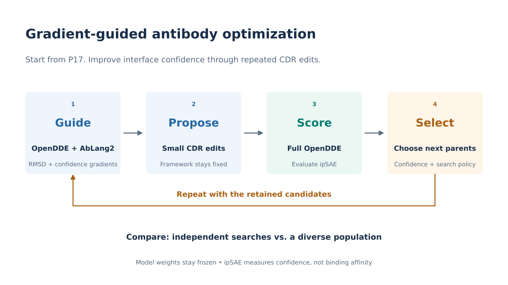

# P17 optimization: status and next steps

Updated **2026-09-30**. Start here for the current handoff; the
[full project record](p17_jn1_redesign.md) retains the biology, infrastructure,
literature discussion, and Claude/Codex reviews.

## Current status

**The eight-run cluster search pilot and the 36-prediction pose-validation/
repeat batch completed. Predicted confidence improved, but reference-pose
recovery and binding have not been established.** Full confidence-aware gradients
are implemented; optional pose-aware retention and a gated sequential experiment
are now implemented and locally tested. The new workflow has not run on H200.

The next step is a pose-measurement/guidance diagnostic, followed conditionally
by a four-arm population comparison. The new controls and sequential launcher
are **implemented; real-model validation is pending**. See [the detailed handoff, §17](p17_jn1_redesign.md#17-completed-cluster-review-and-next-two-tests--2026-09-30).

## Goal and agreed approach

Improve P17's predicted interface confidence against JN.1 while retaining the
framework and restricting edits to the allowed CDR positions. The current hard
WT-relative edit cap is 5; increasing it to 7 remains undecided.



1. **Guide:** frozen full OpenDDE supplies contact, coordinate-RMSD, ipTM,
   bidirectional interface-PAE and pTMEnergy losses. Combine these with frozen
   AbLang2 and the edit penalty; differentiate with respect to sequence inputs.
   The previous proxy remains available with `--proposal-path distogram`.
2. **Propose:** sample feasible CDR edits using gradient deltas and controlled
   proposal entropy. Allow reversions, replacements, and position exchanges.
3. **Score:** full OpenDDE runs forward-only. The provisional retention score is
   mean per-seed directional-min ipSAE across a fixed set of structural seeds.
4. **Select and repeat:** confidence affects retention and therefore future parents.
   Optional pose-aware retention gives lower pose violation priority over confidence.

No additional model training is needed. ipSAE is a structural-confidence proxy,
not an affinity measurement. The separate affinity-model effort is not required
for this first comparison.

## Search policies

| Policy | Current role | Retention |
|---|---|---|
| Independent searches | Completed pilot comparison arm | Each trajectory compares offspring with its own parent |
| Population with local competition | Provisional fixed policy for the next ablation | Offspring competes with a nearby sequence; retain alternatives and protect the best active candidate |
| Complete WT-relative edit-combination sampling | Deferred follow-up | Reconsider whole edit allocations if the first two policies repeatedly settle on the same position sets |

The first two arms share models, proposal machinery, constraints and scoring.
Both can accept worse confidence according to a shared acceptance temperature;
population initialization also fills duplicate slots with alternatives. With the
optional pose constraint, neither mechanism can increase pose violation. These
are proposed optimization heuristics, not exact MH samplers or reproductions
of a published algorithm. Equal call ceilings do not imply equal GPU time.

## What exists

| Artifact | Purpose |
|---|---|
| [Shared harness](../src/mosaic/search.py) | Backend-independent policy logic, feasibility checks, caching, budgets and event callbacks |
| [P17 runner](../examples/p17_confidence_search.py) | Full-gradient proposal objective, separate forward-only retention scoring, run metadata and memory snapshots |
| [Launcher](../examples/run_p17_confidence_search.sh) | Applies the existing OpenDDE outer-product, structural-token and bf16 patches |
| [Multi-GPU launcher](../examples/run_p17_confidence_search_multi_gpu.sh) | Runs both policies on separate GPUs, with smoke/pilot presets, dry-run preview and worker exit codes |
| [Sequential pose experiment](../examples/run_p17_pose_experiment.sh) | Diagnostics → report gate → four population arms → held-out rescoring |
| [Diagnostic checks](../examples/p17_pose_diagnostics.py) | Reference correspondence, NumPy/JAX geometry, paired gradients and feasible-proposal influence |
| [Tests](../tests/test_confidence_search.py) | Policy behavior, constraints, score aggregation, reproducibility and memory-counter checks |
| [Presentation figure](figures/p17_optimization_slide.pdf) / [detailed figure](figures/p17_optimization_flow.pdf) | Model/search flow for slides or technical discussion |

Runs write `config.json`, `summary.json`, `logs/events.jsonl`,
`logs/memory.jsonl`, `tables/candidates.csv` and `tables/predictions.csv`,
plus PDB/CIF structures and compressed confidence arrays. See the layout below. Search seeds and model/scoring seeds are separate. Repeated
sequences reuse evaluations under the fixed model-seed configuration.
The previous MCMC optimizer and its runners remain separate. The existing shared
loss builder accepts optional confidence terms without changing old callers.

Full-path defaults match the existing full-gradient example: contact 0.5,
coordinate pose 1.0, ipTM 0.025, interface PAE 0.05 per direction, pTMEnergy
0.025, AbLang2 0.10, and edit penalty 5.0. Confidence weights and RMSD tolerance
and pose weight are CLI options. The RMSD tolerance defaults to 0 angstroms; this is a proposal
loss setting, not a retention threshold or a validated optimum. Ordinary global
pTM is not an additional term. The coordinate gradient is not detached.

Raw confidence remains mean per-seed ipSAE-min. Optional `--retention-pose-margin`
adds a worst-seed WT-relative pose ceiling. The shared harness ranks violation
first and raw confidence second; default retention remains confidence-only.
`proposal_loss` replaces the runner's old `cheap_loss` output label; per-term
proposal diagnostics are logged in `logs/events.jsonl`. The summary separately counts
full-gradient calls and standalone confidence predictions; each full-gradient
call includes a full forward and backward pass.

## What has actually been checked

- Before memory instrumentation: 35 targeted tests passed, comprising 25 new
  harness/scoring tests and 10 existing optimizer/loss tests.
- After instrumentation: the 27 tests in `test_confidence_search.py` passed
  again during Codex review, including memory-counter access and monotonicity.
  Ruff passed. These checks did not load or optimize with the real models.
- After full-gradient integration: **53 targeted tests passed; one GPU-counter
  test was skipped on the CPU backend**. Tests exercise each confidence term's
  sequence gradient, JIT integration through the shared loss builder, legacy
  compatibility, argument validation and failure logging. Ruff and CLI checks pass.
- Successful-call output conversion synchronizes results before memory snapshots.
- Both callback wrappers now include input creation inside the protected block,
  record sequence identity and success/error status, and preserve a model error
  when diagnostic logging also fails. No model checkpoints were loaded by these tests.

The GPU counter test is not a real-model smoke test. Peak memory is a running
allocator high-water mark, including previous work; a new shape does not reset it.
The two biological control cases with three prediction seeds each do not provide
six independent binding examples or validate a general candidate-ranking metric.

## Completed cluster findings

The saved [pilot review](../results/p17_pilot_review/review.json) records all eight
search workers exiting 0, with 256 score calls and 202 gradient calls. Mean best
selection ipSAE was 0.0304 for independent and 0.1351 for population; four search
seeds per policy do not establish a general policy advantage.

The [pose review](../results/p17_pose_review/review.json) records 27 predictions
for WT plus eight winners at structural seeds 0/1/2, then nine seed-0 repeats.
The [candidate table](../results/p17_pose_review/candidate_summary.csv) gives the
strongest rescored candidate (`population_seed3`, review ID 8) mean ipSAE 0.2539
and minimum 0.2060, versus WT 0.0000. Its mean binder-pose/target-fit/binder-internal
RMSDs are 33.71/16.24/16.66 Å; WT gives 48.19/16.04/16.12 Å. These large target and
internal discrepancies require correspondence/alignment checks before using the
pose metric to make stronger claims or enforce a retention threshold.

Same-seed repeats differed by up to 0.0262 in ipSAE and 1.295 Å in reported pose
RMSD. Confidence gain is encouraging; exact repeatability and correct pose were
not demonstrated. These values are transcribed from existing local review
products, not a new model run. The original pilot lacked saved structures;
the later structures are new predictions of its saved sequences. The review's
artifact check covered seed-0 validation/repeat artifacts, not every seed-1/2 file.

## Next moves, in order

1. **Test 1: verify pose measurement and guidance influence.** Audit residue/CA
   correspondence, units and target alignment; cross-check rigid transforms and
   binder-only displacement. Compare gradients and feasible mutation-proposal
   probabilities with pose guidance on/off under the same sequence and model
   seed, preserving random-key scheduling. Check a small prespecified edit set
   with forward predictions and measure repeat variability.
2. **Gate the next experiment on the diagnostic report.** Finite gradients and
   exit 0 do not suffice. Unexplained target-fit RMSD near 16 Å, inconsistent
   mapping, or no proposal influence prevents automatic continuation. Record
   explicit provisional tolerances before running the comparison.
3. **Test 2: isolate guidance from retention.** Fix population search and run
   four arms: neither pose mechanism, guidance only, retention only, both.
   The launcher uses two search seeds per arm across eight GPUs, matched settings
   and call ceilings, and records actual compute. Retention uses worst-seed WT
   pose RMSD plus a provisional 3 Å margin; WT is feasible by construction.
4. **Evaluate separately.** Rescore WT and winners on structural seeds reserved
   from tuning and selection. Report confidence, pose, target fit, binder shape,
   feasible fractions and compute cost. This remains a predictor experiment,
   not validation of affinity or binding recovery.

A sequential launcher, pose-weight switch and pose-aware retention are now
implemented and locally tested. Real-model gradient influence remains unverified. See [§17 of the full record](p17_jn1_redesign.md#17-completed-cluster-review-and-next-two-tests--2026-09-30)
for acceptance semantics, diagnostic requirements and the implementation handoff.
Simply increasing both pose and confidence weights would confound this comparison;
clipping and entropy normalization can also suppress the effect of weight scaling.

## Run the new sequential experiment

```bash
cd /storage/frank/mosaic
bash examples/run_p17_pose_experiment.sh --devices 0,1,2,3,4,5,6,7 --dry-run
bash examples/run_p17_pose_experiment.sh --devices 0,1,2,3,4,5,6,7
```

Two diagnostic workers run first (proposal-model seeds 0/1). They check
correspondence/geometry, pose on/on-repeat/off gradients, changes in feasible
proposal probabilities and matched WT/edit forward predictions. Both reports
must pass before launching eight population workers: four arms × search seeds
0/1. Selection uses structural seeds 0/1; held-out rescoring uses 101/102/103.
Defaults: 8 sampling steps, 32 score calls, 32 gradient calls, 320 proposals per
search worker. Each score call uses two forward predictions.

The provisional gate requires target-fit RMSD ≤3 Å and proposal total variation
>max(1e-4, 3×repeat variation), alongside correspondence and numerical checks.
The earlier ~16 Å target fit would stop the workflow before search. Thresholds
are recorded and configurable; passing does not prove pose improvement. Repeats
here occur within a worker and do not measure fresh-process variability.

Outputs are organized under `diagnostic/`, `search/`, `heldout/`, `tables/` and
`logs/`, including CIF/PDB/NPZ, gradient/proposal diagnostics, per-run ceilings,
common-threshold feasibility summaries, raw scores, actual calls and exit codes.
A failed stage preserves its evidence and prevents dependent stages. Use a
fresh output directory on every launch. The checkout path is detected by the
shell wrapper; no `/home/yfeng17` path is hardcoded.

The first H200 attempt stopped before model assessment: the reference audit
reported a 0.010634 Å NumPy/JAX mismatch. This was reproduced locally on an RTX
4090 and corrected by scoping float32 matmul precision to `BinderPoseRMSD`.
The actual reference controls now agree within approximately 1.3e-5 Å; the
0.001 Å agreement threshold and 3 Å target-fit gate remain unchanged.

After this fix, **87 CPU tests passed**, with **one GPU-only memory test skipped**,
and **four new geometry/gradient cases passed on the RTX 4090**, including JIT
execution and reduced-precision outer settings. H200 verification and real-model
guidance assessment are still pending. Sync the updated checkout and relaunch
with the command above; the launcher creates a fresh result directory. See
[§17.7](p17_jn1_redesign.md#177-cluster-geometry-failure-and-scoped-precision-fix)
for the failure evidence and optional checkpoint-free GPU regression command.
See [§17.6](p17_jn1_redesign.md#176-implemented-workflow-and-launch-commands)
for exact semantics, settings, reporting definitions and limitations.

## Existing launch commands (historical workflow)

The commands below remain useful for regression checks or reproducing the earlier
workflow. They do not implement the new diagnostic/four-arm protocol.

Minimal smoke commands, from the repository root:

```bash
CUDA_VISIBLE_DEVICES=0 bash examples/run_p17_confidence_search.sh \
  --policy independent --proposal-path full --width 2 --seed 0 \
  --max-score-calls 2 --max-gradient-calls 1 --max-proposals 2 \
  --selection-seeds 0 --output-dir results/p17_smoke_independent

CUDA_VISIBLE_DEVICES=0 bash examples/run_p17_confidence_search.sh \
  --policy population --proposal-path full --width 2 --seed 0 \
  --max-score-calls 2 --max-gradient-calls 1 --max-proposals 2 \
  --selection-seeds 0 --output-dir results/p17_smoke_population
```

Each arm covers WT scoring, one parent gradient and at most one new candidate
score. This checks execution and logging; it cannot demonstrate policy superiority.

## H200 multi-GPU launcher

The launcher resolves the checkout and `.venv` relative to its own location,
so `/storage/frank/mosaic` works without replacing paths in the script. Run
inside an existing GPU allocation with the cluster environment and model assets
available:

```bash
cd /storage/frank/mosaic
bash examples/run_p17_confidence_search_multi_gpu.sh --dry-run
bash examples/run_p17_confidence_search_multi_gpu.sh --mode smoke --devices 0,1
# After inspecting the smoke results:
bash examples/run_p17_confidence_search_multi_gpu.sh
```

The default pilot runs search seeds 0–3 for each policy: eight processes, one
per GPU, width 4, up to 32 unique scored sequences, 32 gradient calls and 320
proposals per run. These are provisional pilot budgets. Both policies keep
proposal-model seed 0, selection seed 0, eight sampling steps, edit cap 5 and
the full proposal loss defaults. Four search seeds are exploratory, not evidence
of a statistically established policy advantage.

GPU IDs default to the caller's `CUDA_VISIBLE_DEVICES`, or 0–7 if unset;
`--devices` overrides this list. With fewer GPUs, jobs run in bounded batches.
`--num-seeds N` changes the search seed count per policy. This distributes runs,
not an individual model call, and explicitly selects the JAX CUDA backend.
Patches run once before workers start. A fresh batch directory holds each run's
outputs under `runs/<policy>/seed_N/`, console logs under `logs/`,
`logs/patches.log`, `commands.sh` and `tables/status.tsv`.
The launcher waits for all runs and exits nonzero if any fail. `--dry-run` only
prints the plan; it does not patch dependencies, create outputs or load models.
The September 29 pilot and September 30 pose-validation batch completed on the
cluster. The new diagnostic/retention revision still requires its own real-model
checks; earlier success does not validate an unrun code revision.

## Saved structures and output layout (version 2)

Every unique candidate scored by full OpenDDE, including WT and rejected
candidates, saves one protein-heavy-atom PDB per selection seed. These are the
same predictions used for scoring; export does not rerun the model. Large
logits are excluded from the host transfer. The saved NPZ contains mean PAE,
pLDDT (0–1), CA and atom37 coordinates, atom masks, sequence, chain IDs and
residue numbering. PDB B-factors contain pLDDT on the 0–100 scale. PDB coordinates
use standard text precision; NPZ retains numeric coordinate arrays.

```text
batch/
├── README.md
├── commands.sh
├── logs/                        # patch and per-worker console logs
├── tables/status.tsv            # worker GPU, PID and exit code
└── runs/
    ├── independent/seed_0/      # also seed_1, seed_2, seed_3
    │   ├── README.md
    │   ├── config.json
    │   ├── summary.json
    │   ├── tables/
    │   │   ├── candidates.csv   # rank, sequence, aggregate score, structure folder
    │   │   └── predictions.csv  # per-seed metrics, chain identities, file paths
    │   ├── logs/               # events.jsonl and memory.jsonl
    │   ├── structures/candidate_00000/seed_0.pdb
    │   ├── confidence/candidate_00000/seed_0.npz
    │   └── best/               # winning candidate PDBs, one per selection seed
    └── population/seed_0/       # same layout for every population run
```

Candidate 0 is WT. Candidate IDs match events and both CSVs. `predictions.csv`
paths are relative to the run directory; its seed column is the structural
selection seed, distinct from the search seed in the enclosing directory.
All scored candidates get structure/confidence folders, not only candidate 0.
The `best/` copies and `summary.json` are written after successful completion.
Prediction files and their index are written incrementally; an interrupted run
can therefore have usable predictions without a final summary or candidates CSV.

This changes the former flat output paths for new runs; existing result folders
are not migrated. The search objectives and budgets are unchanged. Export adds
host transfer and disk I/O, included in scoring time, but no extra model calls.
No gradient-path structures or held-out predictions are generated.

Validation: **43 tests passed, one GPU-memory test skipped on CPU** in
`tests/test_confidence_search.py`. New checks cover PDB round trips (chain,
residue, side-chain coordinates and pLDDT), NPZ contents, JIT payload pruning,
rejection of mismatched/nonfinite predictions, and an entire toy runner with
both scoring seeds and matching prediction counts. These tests do not establish
real-model H200 memory fit or performance.

## Pose review of the completed pilot

In the completed pilot, RMSD guided proposals but did not constrain retention.
The loss
aligns the predicted target CA atoms to reference target CA atoms, then measures
binder CA displacement using that same transform. Independently aligning the
binder would hide rigid-body pose drift. A low binder-internal RMSD therefore
does not establish a correct binding pose.

Exports now include mmCIF alongside PDB, and `tables/predictions.csv` reports
`binder_pose_rmsd_A`, `target_aligned_rmsd_A` and `binder_internal_rmsd_A` on the
exact scored forward prediction. These were diagnostic exports in the completed
workflow. The new optional retention condition uses worst-seed binder pose RMSD
relative to a fixed WT-calibrated ceiling; raw ipSAE remains separately reported.
The reference is `P17_JN1.pdb`, binder chain B and target chain T. Prediction
chain names are recorded in the CSV and may differ from reference chain names.

The downloaded September 29 pilot completed all eight runs but predates structure
export. Its sequences are preserved. The subsequent September 30 validation and
repeat batch also completed; findings are summarized above. These commands
document how that rescoring workflow can be repeated in fresh output folders:

```bash
cd /storage/frank/mosaic
CUDA_VISIBLE_DEVICES=0 bash examples/run_p17_rescore_winners.sh \
  --input results/p17_confidence_pilot_20260929_194857_1770469 \
  --output-dir results/p17_winner_pose_review \
  --seeds 0 1 2
```

For both validation and repeatability in one command, distribute the sequences
across all eight allocated GPUs:

```bash
cd /storage/frank/mosaic
bash examples/run_p17_pose_validation.sh --devices 0,1,2,3,4,5,6,7
```

The launcher defaults to `CUDA_VISIBLE_DEVICES`, or GPUs 0–7 if unset. Use
`--devices` to specify the allocation explicitly; `--device 0` still supports
single-GPU execution. `--input` accepts a batch directory or archive;
`--output-dir` overrides the fresh timestamped output root. `--dry-run` previews
all assignments without patching dependencies or running models.

Global candidate IDs are partitioned by ID modulo GPU count. For the nine
sequences in this pilot, GPU 0 handles WT plus one winner and GPUs 1–7 each
handle one winner. Stage 1 predicts seeds 0, 1, 2 concurrently across GPUs.
After every worker succeeds, stage 2 repeats seed 0 in fresh processes with the
same candidate-to-GPU assignment. Total work remains 27 + 9 = 36 predictions,
not 36 per GPU. Each prediction must fit on its assigned GPU.

Patches run once. Each stage has `shard_N/` folders for structures, confidence
arrays, metadata and local tables. Stage-level `tables/candidates.csv`,
`tables/source_runs.csv` and `tables/predictions.csv` combine the workers; artifact
paths in the combined prediction CSV are relative to that stage directory.
`logs/` contains separate worker logs, and `status.tsv` records stage, shard,
GPU, PID and exit code. A worker failure prevents the repeat stage from starting.
The launcher waits for all active workers before reporting a stage failure.

Validation: 48 tests passed, one GPU-memory test skipped on CPU. The actual
archive dry-run confirms the 27 + 9 split. Disposable fake-worker checks verify
parallel execution without GPU overlap, a barrier between stages, fresh repeat
processes, valid merged artifact paths, and failure propagation. No cluster
predictions were launched by these checks.

These stages have now completed on the cluster. Their results motivate the
measurement/guidance diagnostic above, not a larger search campaign yet. Two
executions of seed 0 exposed differences but cannot establish their full
distribution or cause, policy superiority or binding.

For the standalone `run_p17_rescore_winners.sh` command above, add `--dry-run`
to preview without patches, model loading or output writes. `--input` also accepts the downloaded `.tar.gz` archive directly. Default sampling
steps and cutoffs come from the saved run configuration. This batch is 27
forward predictions on one GPU; it does not run gradients, optimization or
AbLang2 inference. Seed 0 revisits the original selection seed; 1 and 2 were not
used for selection in this pilot. This does not test repeated seed 0 across
fresh processes; use a second fresh output directory for that check.

Outputs include `reference.pdb`, config and summary JSON,
`tables/candidates.csv`, `tables/source_runs.csv`, `tables/predictions.csv`,
`structures/` (CIF/PDB), `confidence/` (NPZ), and `logs/memory.jsonl`.
Candidate IDs are local to this new batch; `source_runs.csv` maps them back to
original runs and candidate IDs. Predictions are saved incrementally. They are
new predictions, not recovery of the original unsaved poses, and may differ.

Validation: 46 confidence-search tests passed, one GPU-memory test skipped on CPU.
Checks include rigid-body alignment invariance, preserved binder displacement,
CIF round trips, deduplicated winner loading from directories/archives, and a toy
end-to-end rescoring run. No real-model rescoring has been launched locally.

## Deferred decisions and reference map

Hold non-pose objectives and settings fixed in the next four-arm population
comparison; vary only pose proposal guidance and pose retention. The explicit
pose-retention condition is implemented; its cluster comparison is conditional
on passing the measurement and guidance diagnostics. A separate full-versus-distogram ablation, Germinal-inspired gradient
balancing, alternative confidence metrics, surrogate/BO evaluation allocation,
batching and policy 3 remain deferred.
Automatic resume remains unimplemented. Winner rescoring now supports additional
structural seeds, and raw mean-PAE matrices are saved with each prediction.

The [full handoff](p17_jn1_redesign.md) contains the **26-paper index plus a pinned
BindCraft2 source reference** in §8.13; policy rationale in §10; Claude's response
in §11; initial implementation in §12; memory instrumentation in §13; and the
full-gradient integration and logging fixes in §14; structure export in §15;
pose rescoring in §16; completed cluster findings and the next two tests in §17.
The [literature survey](protein_search_policy_review.md) records broader context
and limits of the paper review. The main influences remain EvoProtGrad/PPDE,
AdaLead, ME-GIDE, PEX, LaMBO-2, BADASS and Germinal; their ideas are adaptations
here, not evidence that the current P17 implementation works.
